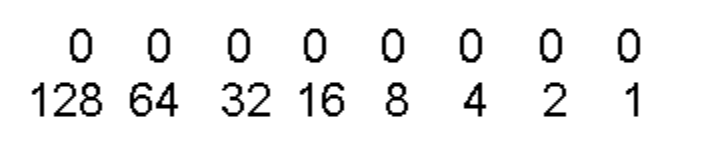
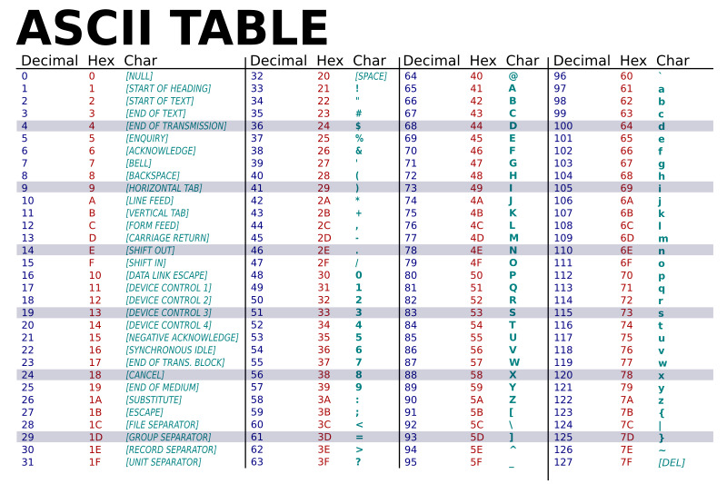

# Introduction

## Un domaine assez large


## La programmation

Un ordinateur est un assemblage de composants permettant la lecture séquentielle d'un ensemble d'instructions (programmes). Ces instruction permettent d'effectuer des opérations:

- Logiques : AND, OR, NOR, ...
- Arithmétiques : Somme, multiplication, ...


L'utilisateur, le programmeur, ou bien le système d'exploitation peut donner en input des instructions et obtenir la réponse en output.

## Les types de langages

### La compilation et l'interprétation

Dans l'absolue, il serait nécessaire d'écrire chaque programme informatique en langage machine. Cependant, afin de faciliter la tâche de programmation, des langages de programmation sont apparus. Comment passe t'on d'un code écrit en langage lisible pour un humain à des instructions exécutables par un ordinateur ?

Il existe deux types de langages: les langages compilés et interprétés.


Un langage compilé (C, C++, Go, ...) est un langage de programmation dont le code source est traduit en un programme exécutable spécifique à la plateforme cible (Windows, macOS, ...).

Le développeur compile le code à l'aide d'un compilateur (traducteur entre langage source et code machine).

Les étapes principales de la compilation sont les suivantes:

- **Analyse lexicale et syntaxique**: Le code source est découpé en jetons et analysé grammaticalement pour vérifier sa structure et sa syntaxe.

- **Analyse sémantique**: Le compilateur vérifie la cohérence du code source et s’assure qu’il respecte les règles sémantiques du langage.

- **Optimisation du code**: Le compilateur applique des techniques d’optimisation pour améliorer les performances du code généré.

- **Génération de code machine**: Le compilateur traduit le code source optimisé en instructions machine spécifiques à la plateforme cible.

- **Liaison**: Le compilateur peut lier le code généré avec des bibliothèques externes et d’autres modules pour créer un exécutable complet.

Les langages compilés ont des avantages comme la rapidité (code déjà traduit et optimisé à l'exécution) mais ont généralement peu de portabilité sur différentes plateformes.

Un langage interprété (Python, JavaScript, Ruby, ...) est un langage de programmation dont le code source est traduit puis exécuté ligne par ligne en temps réel.

Cette analyse du code source est faite par un interpréteur qui transforme le code source en instructions machine avant de l’exécuter. Contrairement à un compilateur, la traduction du code source est faite au moment de son exécution, par le processeur de l’utilisateur final.

Les étapes principales de l'interprétation sont les suivantes:

- **Analyse lexicale et syntaxique**: Le code source est découpé en jetons et analysé grammaticalement.

- **Interprétation ligne par ligne**: L’interpréteur analyse une ligne de code et la convertit en instructions machine que le processeur peut comprendre.

- **Exécution de l’instruction**: L’instruction machine est envoyée au processeur pour être exécutée.

- **Passage à la ligne suivante**: L’interpréteur passe à la ligne suivante de code et répète le processus.

### Le code binaire

Un code binaire représente un texte, des instructions de processeur ou toute autre donnée utilisant un système à deux symboles. Le système à deux symboles (base 2) utilise des 0 et des 1. Le code binaire assigne une combinaison de chiffres binaires, également appelé bits. Par exemple, une chaîne binaire de huit bits peut représenter n'importe laquelle des 255 valeurs possibles.

\
Chaque 0 représente un bit. Chaque bit représente la valeur 0 ou 1 (ON ou OFF). On peut convertir n'importe quel chiffre en binaire.

- Pour représenter la valeur 255:

  ```txt
  11111111 = 128 + 64 + 32 + 16 + 8 + 4 + 2 + 1 = 255
  ```

- Pour représenter la valeur 134:

  ```txt
  10000110 = 128 + 0 + 0 + 0 + 0 + 4 + 2 + 0 = 134
  ```

### Le code hexadécimal


Comme le binaire, on peut utiliser d'autres systèmes de représentation comme l'hexadécimal. Le binaire a une `base 2 (0 ou 1)`, tandis que l'hexadécimal a une `base 16 (0, 1, 2, 3, 4, 5, 6, 7, 8, 9, A, B, C, D, E, F)`. C'est un système intermédiaire avec le binaire pouvant simplifier la représentation d'un chiffre.

Prenons le binaire suivant:

```txt
122 = 01111010
```

Pour le convertir en hexa il faut:

- Grouper par groupe de 4 chiffres.

  ```txt
  0111 1010
  ```

- Convertir chaque groupe en valeur hexadécimal.

  ```txt
  0111 = 1 + 2 + 4 = 7
  1010 = 8 + 2 = 10
  ```

- Dans le système hexadécimal.

  ```txt
  7 (Décimal) vaut 7 (hexadécimal)
  10 (Décimal) vaut A (hexadécimal)
  ```

- On peut écrire.

  ```txt
  122 (Décimal) vaut 7A (hexadécimal) ou bien 0x7A (autre notation hexadécimal)
  ```

Donc: `01111010 = 7A = 122`.\
L'hexadécimal permet de représenter de grands nombres avec moins de caractères.

### ASCII

\
Afin de décrire des lettres on peut aussi utiliser la table ASCII. La table ASCII permet d'attribuer à chaque caractère une valeur décimale. Cette valeur est définie sur la table ASCII et ce standard permet que chaque constructeur de matériel utilise les mêmes valeurs pour chaque lettre.

Pour la lettre z on peut retrouver nos valeurs précédentes:

```txt
01111010 = 122 = 7A = z
```

Jusque là, la valeur 122 (01111010 en binaire) pourrait vouloir dire:

- Le caractère z.

- Le nombre 122.

- Une valeur de données d'image (un pixel par exemple).

- Une commande (charger quelque chose de la mémoire, exécuter une addition, ...).

#### Comment l'ordinateur sait quel sens donner à 01111010 ?

Eh bien il ne le sait pas. C'est le compilateur ou l'interpréteur qui le fait. Lors de la compilation ou de l'interprétation, le programme de traduction choisit le contexte en fonction de ce qui est écrit dans le code.

Par exemple:

- Si je stocke la lettre "z" en mémoire dans mon code, le compilateur ou l'interpréteur indiquera dans les instructions données à l'ordinateur que c'est une lettre. 122 sera donc marqué comme une lettre.

- Si je stocke la valeur 122 en mémoire dans mon code, le compilateur ou l'interpréteur indiquera dans les instructions données à l'ordinateur que c'est un chiffre entier. 122 sera donc marqué comme un chiffre.

Et c'est la même chose pour une commande, une image, ...

#### En résumé

- On peut coder n'importe quelle lettre ou chiffre en binaire.

- L'hexadécimal permet une version intermédiaire du binaire, plus simple à lire.

- La différence entre un chiffre, une lettre ou bien une commande pour la même valeur de binaire se passe durant la traduction du programme en langage machine, où le compilateur/interpréteur fait le choix en fonction de ce qui est écrit dans le code.

- Le code et le compilateur/interpréteur permet de choisir le contexte dans la traduction et génère les bonnes instructions en binaire.

- Le CPU exécute les instructions en binaire peu importe le contexte.

### Les niveaux de langages

On peut hiérarchiser les langages informatiques selon leur éloignement ou proximité avec le langage machine.


Plus un langage est bas niveau plus il se rapprochera syntaxiquement à du langage machine (Assembleur, C, Pascal, ...). A l'inverse, un langage de haut niveau se rapproche de l'anglais (Python, Rust, Javascript, ...).
