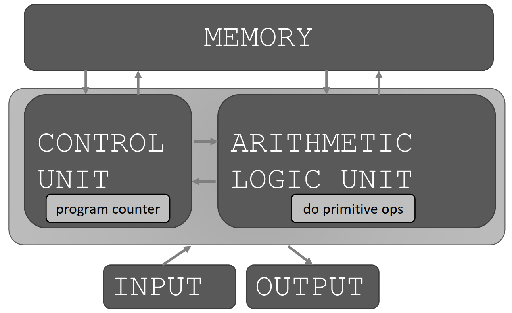
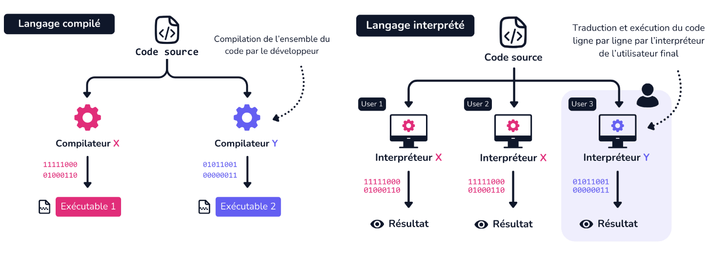
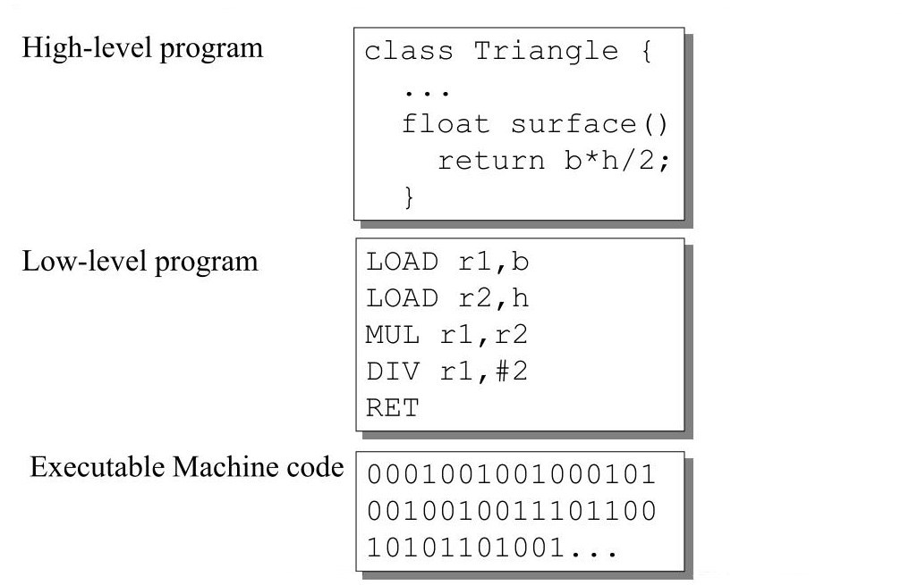

# Introduction

## Un domaine assez large

## La programmation

Un ordinateur est un assemblage de composants permettant la lecture séquentielle d'un ensemble d'instructions (programmes). Ces instruction permettent d'effectuer des opérations:

- Logiques : AND, OR, NOR, ...
- Arithmétiques : Somme, multiplication, ...

L'utilisateur, le programmeur, ou bien le système d'exploitation peut donner en input des instructions et obtenir la réponse en output.

## Les types de langages

### La compilation et l'interprétation

Dans l'absolue, il serait nécessaire d'écrire chaque programme informatique en langage machine. Cependant, afin de faciliter la tâche de programmation, des langages de programmation sont apparus. Comment passe t'on d'un code écrit en langage lisible pour un humain à des instructions exécutables par un ordinateur ?

Il existe deux types de langages: les langages compilés et interprétés.

Un langage compilé (C, C++, Go, ...) est un langage de programmation dont le code source est traduit en un programme exécutable spécifique à la plateforme cible (Windows, macOS, ...).

Le développeur compile le code à l'aide d'un compilateur (traducteur entre langage source et code machine).

Les étapes principales de la compilation sont les suivantes:

- **Analyse lexicale et syntaxique**: Le code source est découpé en jetons et analysé grammaticalement pour vérifier sa structure et sa syntaxe
- **Analyse sémantique**: Le compilateur vérifie la cohérence du code source et s’assure qu’il respecte les règles sémantiques du langage.

- **Optimisation du code**: Le compilateur applique des techniques d’optimisation pour améliorer les performances du code généré.

- **Génération de code machine**: Le compilateur traduit le code source optimisé en instructions machine spécifiques à la plateforme cible.

- **Liaison**: Le compilateur peut lier le code généré avec des bibliothèques externes et d’autres modules pour créer un exécutable complet.

Les langages compilés ont des avantages comme la rapidité (code déjà traduit et optimisé à l'exécution) mais ont généralement peu de portabilité sur différentes plateformes.

Un langage interprété (Python, JavaScript, Ruby, ...) est un langage de programmation dont le code source est traduit puis exécuté ligne par ligne en temps réel.

Cette analyse du code source est faite par un interpréteur qui transforme le code source en instructions machine avant de l’exécuter. Contrairement à un compilateur, la traduction du code source est faite au moment de son exécution, par le processeur de l’utilisateur final.

Les étapes principales de l'interprétation sont les suivantes:

- **Analyse lexicale et syntaxique**: Le code source est découpé en jetons et analysé grammaticalement.

- **Interprétation ligne par ligne**: L’interpréteur analyse une ligne de code et la convertit en instructions machine que le processeur peut comprendre.

- **Exécution de l’instruction**: L’instruction machine est envoyée au processeur pour être exécutée.

- **Passage à la ligne suivante**: L’interpréteur passe à la ligne suivante de code et répète le processus.

### Les niveaux de langages

On peut hiérarchiser les langages informatiques selon leur éloignement ou proximité avec le langage machine.

Plus un langage est bas niveau plus il se rapprochera syntaxiquement à du langage machine (Assembleur, C, Pascal, ...). A l'inverse, un langage de haut niveau se rapproche de l'anglais (Python, Rust, Javascript, ...).
