# Mise en place

## L'éditeur de code

La première chose à installer est un éditeur de texte afin de pouvoir programmer. En soit, il serait possible de programmer avec n'importe lequel, y compris Bloc-notes sur Windows. Cependant il existe de nombreux éditeurs avancés permettant l'accès à beaucoup de fonctionnalités liées à la programmation.

Ici nous allons installer **Visual Studio Code** qui est un des éditeurs les plus utilisés et qui permet de développer facilement sous n'importe quel langage de programmation.

Télécharger VSCode:

```txt
https://code.visualstudio.com/
```

Un fois installé, nous allons pouvoir installer les plugins nécessaires au développement python.

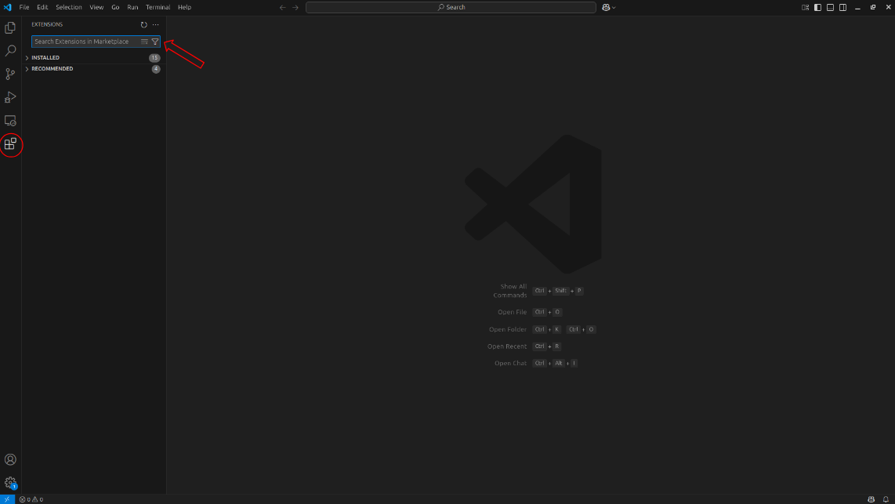

Pour chacune des extensions suivantes, le télécharger et les installer:

- **Python**: Gère le code python sous VSCode.
- **isort**: Trie automatiquement les imports de librairies dans un fichier de code.
- **Black Formatter**: Formate les fichiers de code.
- **Pylint**: Surligne les erreurs ou les pratiques déconseillées.

Quelques raccourcis utiles pour plus tard:

- `shift + alt + f` Formate le fichier actuel avec Black Formatter.
- `shift + alt + o` Trie les imports de librairies avec isort.
- `ctrl + :` Commente les lignes de code sélectionnées.

## Anaconda

Nous allons maintenant passer aux environnements virtuels. En programmant en python (mais pas forcément pour les autres langages) il est souvent nécessaire d'utiliser des environnements virtuels.

### Les bibliothèques

En informatique, lorsque que l'on écrit un programme, il est très courant d'utiliser des bibliothèques. Les bibliothèques sont du code téléchargeable sur internet pouvant être utilisé par d'autres développeurs.

Par exemple, si je veux programmer un algorithme de machine learning assez complexe, il est probable qu'une librairie existe avec une implémentation de cet algorithme. Au lieu de tout recoder, je peux installer cette librairie et avec accès aux différents algorithmes déjà développés. Cela permet de gagner du temps et d'utiliser des implémentations de code souvent robustes et efficaces.

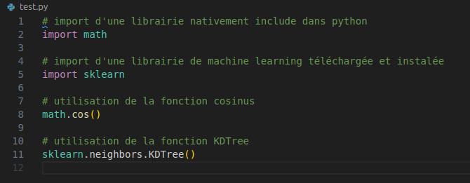

### Les environnements virtuels

Dans tous langages, la gestion des bibliothèques peut être une tâche ardue. En effet, la majeure partie des bibliothèques ont des dépendances (dépendent d'autres bibliothèques). Cela peut engendrer des conflits de compatibilité entre bibliothèques.

```txt
Une bibliothèque A dépend d'une bibliothèque C en version 1.0.0.
Une bibliothèque B dépend d'une bibliothèque C en version 1.1.0.

Si j'installe A et B, un conflit apparaît car une seule version d'une dépendance est autorisée dans l'environnement d'un projet.
```

De plus, si une bibliothèque est directement installée à une version spécifique sur l'ordinateur, il faudra la désinstaller plus tard si un nouveau projet requiert une version différente.

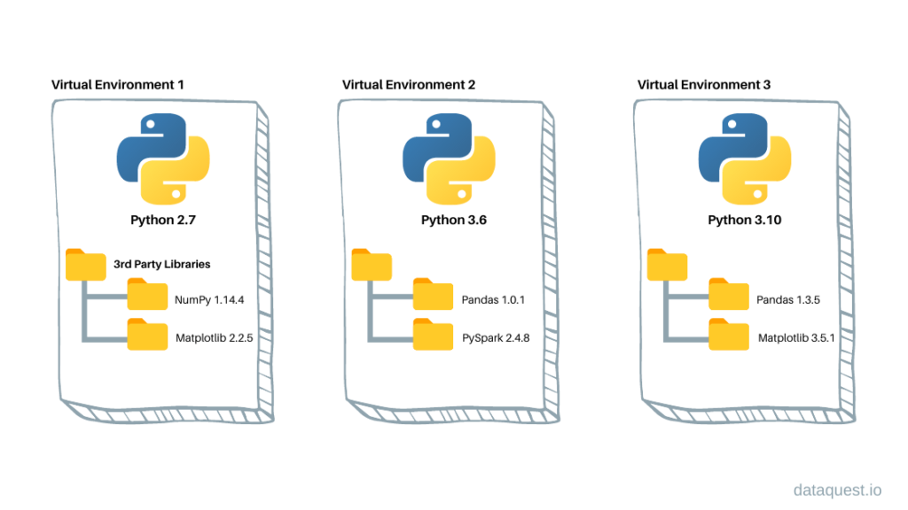

Pour pallier ces problèmes on utilise des environnements virtuels. La création d'un environnement virtuel permet de:

- Créer un environnement contenant les bibliothèques souhaitées pour un projet spécifique.
- Gérer les possibles conflits entre bibliothèques.

Donc pour chaque projet, on peut créer un environnement virtuel dédié avec les librairies seulement nécessaires à ce projet.

### Installation de Conda

Télécharger miniconda:

```txt
https://www.anaconda.com/download/success
```

Durant l'installation, cocher les 2 cases marquées comme recommandé:

- `Register Miniconda3 as my default Python 3.12`
- `Clear the package cache upon completion`

Pour créer, modifier et supprimer des environnements sur Windows, il faut lancer le programme "Anaconda prompt". Le terminal se lance et l'environnement activé est `base`, comme marqué dans le terminal. Cet environnement est très basique, et il faut mieux éviter de l'utiliser ou de le modifier (installer d'autres bibliothèques dedans).

Lister les environnements de la machine:

```conda
conda env list
```

Lister les bibliothèques installées dans l'environnement actuel:

```conda
conda list
```

Créer un environnement se nommant my_new_env:

```conda
conda create -n my_new_env
```

Activer un environnement se nommant my_new_env:

```conda
conda activate my_new_env
```

Installer une ou plusieurs bibliothèque dans l'environnement actuel:

```conda
conda install bibliothèque_1 bibliothèque_2
```

Désactiver l'environnement actuel:

```conda
conda deactivate
```

Supprimer un environnement se nommant my_new_env:

```conda
conda remove -n my_new_env --all
```

### Test de conda et VSCode

Via Anaconda prompt, on va pouvoir créer un environnement se nommant `my_new_env`. On va y installer les bibliothèques suivantes:

- python
- scikit-learn

Dans VSCode:

- Créer un fichier test.py
- Ajouter le code suivant:

```python
import sklearn
print("Hello world")
```

- Faire `ctrl + shift + p`: puis taper `Python: Select Interpreter`

- Sélectionner un environnement et lancer le code avec l'icône flèche:
  - Avec base, le code crash car scikit-learn (bibliothèque non native) n'est pas installée.
  - Avec my_new_env, le code s'éxecute.

## Git

En informatique, il est très courant et presque obligatoire d'utiliser Git. Git est un logiciel de gestion de version de fichiers qui permet de conserver un historique des modifications effectuées sur un projet afin de pouvoir rapidement identifier les changements effectués et de revenir à une ancienne version en cas de problème.

### Fonctionnement


Dans la majeure partie des cas, on travaille avec une version du code en local sur un PC et avec une version sur un serveur distant. L'utilisateur peut travailler sur sa version locale et l'envoyer ensuite sur la version distante pour la mettre à jour. De plus, si plusieurs personnes travaillent sur le même projet, l'utilisateur peut récupérer les nouvelles modifications sur le répertoire distant en local. Lorsque l'on parle d'un projet Git, on utilise le terme dépôt en français et repository en anglais.

```bash
git clone <url>
```

Clone (télécharge) un dépôt sur le PC.

```bash
git add /path/vers/un/fichier/local
```

Ajoute le contenu de fichiers à l’index. L'index contient les fichiers prêts à être envoyés vers le dépôt distant. Lorsque des fichiers ont été ajoutés à l'index on peut faire `git status` pour afficher l'état du répertoire de travail et de la zone d'index et `git diff --staged` pour visualiser les différences entre le dépôt local et distant sur les fichiers présents dans l'index.

```bash
git commit -m "Mon message de commit"
```

Créer un nouveau commit contenant le contenu actuel de l’index et avec le message de validation décrivant la modification.

```bash
git push
```

Met à jour le dépôt distant à l’aide des modifications locales présentes dans le commit.

```bash
git fetch
```

Télécharge les modifications du dépôt distant vers le dépôt local, mais n'apporte aucune modification au répertoire de travail en cours.

```bash
git pull
```

Télécharge les modifications les plus récentes du dépôt distant comme git fetch, mais elle fusionne également automatiquement ces modifications au dépôt local.

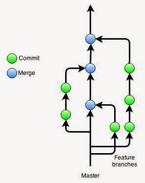

Une autre fonctionnalité de Git est de pouvoir travailler sous plusieurs versions parallèles du code et cela à plusieurs. Dans tout projet Git on dispose de la branche principale appelée Master (ou main).

Cette branche est censée toujours contenir une version stable du code. Lorsqu'un développeur veut ajouter une fonctionnalité, il peut créer une nouvelle branche à partir d'un commit donné. Le développeur fait donc des modifications (commit et push) sur sa branche sans impacter la branche principale. Lorsque la nouvelle fonctionnalité est prête, il peut alors la merge avec la branche principale et les deux branches fusionnent.

Cela permet de :

- D'éviter du code instable sur la branche principale
- D'éviter les conflits de versions sur la même branche entre développeurs
- D'améliorer la visibilité de l'historique Git

### Installation

GitHub est un service en ligne qui permet d’héberger des dépôts ou repo Git. C’est le plus grand hébergeur de dépôts Git du monde.

Une grande partie des dépôts hébergés sur GitHub sont publics, ce qui signifie que n’importe qui peut télécharger le code de ces dépôts et contribuer à leur développement en proposant de nouvelles fonctionnalités.

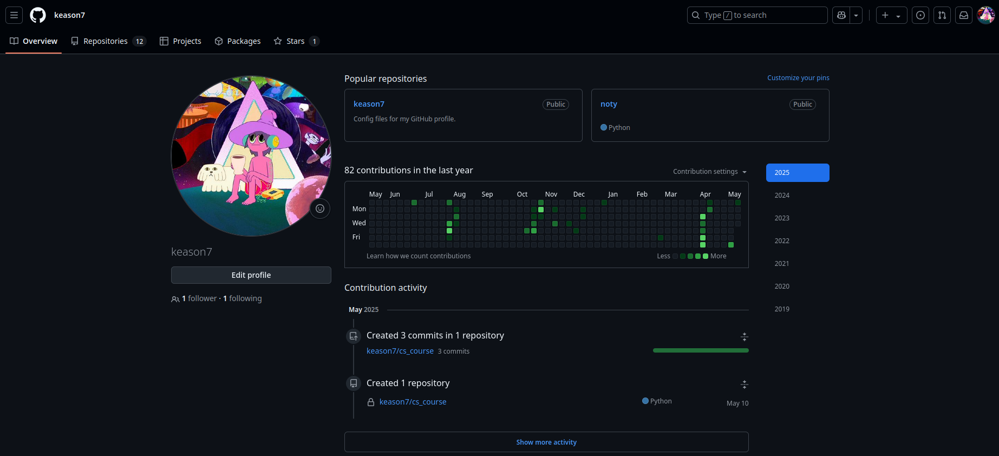
Le profil GitHub, contenant des repositories. L'utilisateur peut travailler sur ses projets, mais aussi proposer des modifications de code sur d'autres projets (publics ou privés si il est invité en collaborateur).

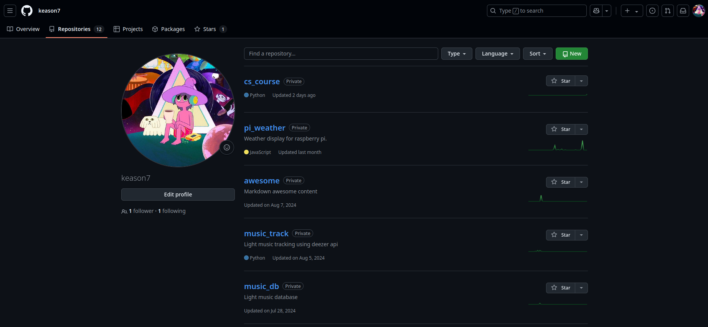
Chaque utilisateur peut créer des projets Git et les mettre en public ou privés.

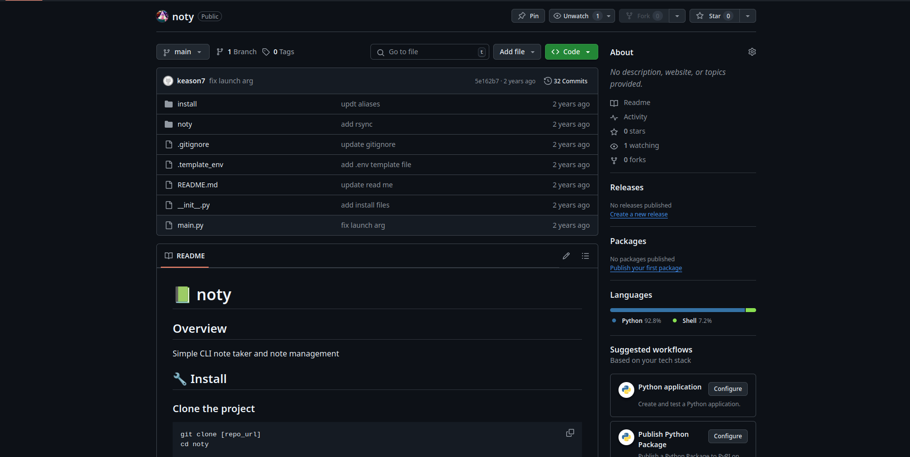
Un exemple de projet Git. On peut y voir les différents fichiers (et les afficher en cliquant dessus), le nombre de commits, l'historique de version du projet ainsi qu'un README contenant une description du projet et les étapes d'installation et d'utilisation.

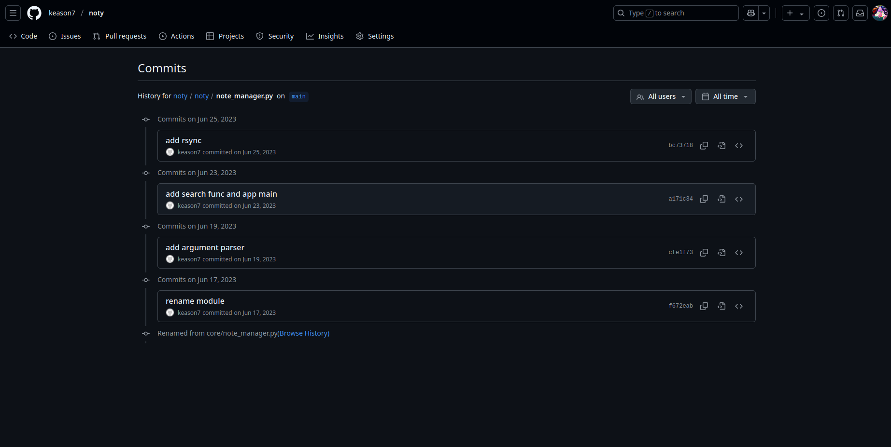
On peut visualiser l'historique des commits de chaque fichier. Cela permet de comprendre ce qui a été ajouté/modifié au fil du temps.

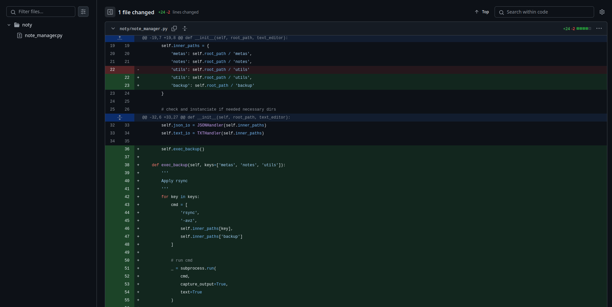

En cliquant sur un commit particulier, on visualise les modifications du commit sur ce fichier.

---

Créer un compte.

```txt
https://github.com/
```

Télécharger Git pour Windows.

```txt
https://git-scm.com/
```

Durant l'installation, choisir VSCode comme éditeur par défaut pour Git.

Dans VSCode:
Taper `ctrl + ,` puis taper `git: enabled`. Vérifier que Git est bien activé. On peut fermer puis réouvrir VSCode.

Ouvrir un terminal windows et taper les commandes suivantes:

```bash
git config --global user.email "email@domain.com"
git config --global user.name "username"
```

Il faut remplacer l'email et l'username, par ceux utilisés durant l'inscription GitHub.

Nous allons pouvoir créer un nouveau projet Git.

Dans GitHub: \
`Mon profil` &rarr; `Repositories` &rarr; `New`.

Créer un projet:

- Nom: `test_project`
- Cocher: `Add a README file`

Dans le projet GitHub, cliquer sur `Code` &rarr; `HTTPS` &rarr; `Copier l'url du projet git`.

Dans VSCode:

- `ctrl + shift + p` puis taper `Git: Clone`.
- `Coller l'url du projet git` et taper sur la touche `Entrée`.

On va pouvoir choisir où le projet va être enregistré.

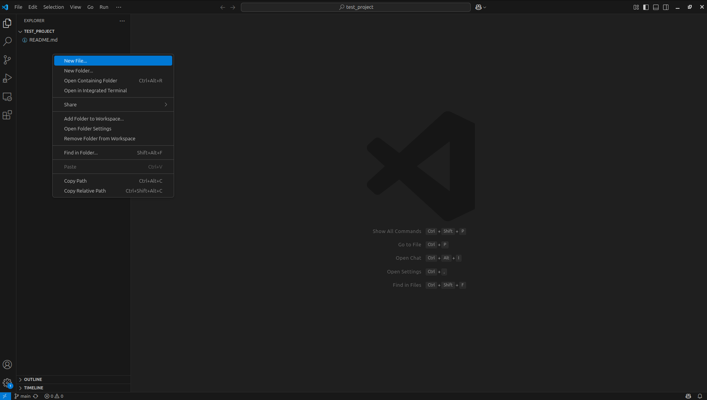
Pour tester, on peut créer un nouveau fichier nommé `test.py` dans le repository git en local dans VSCode.

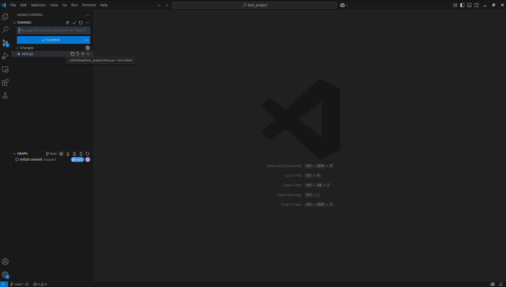

En laissant la souris dessus on voit que le fichier est `untracked`, ce qui veut dire que le fichier n'est pas présent dans le répertoire Git distant. Une modification pouvant mener à un commit est l'ajout d'un fichier `untracked`, la suppression d'un fichier `tracked` et la modification d'un fichier `tracked`. D'autres actions peuvent aussi mener à un commit comme les déplacements des fichiers `tracked` ou bien leur renommage.

On peut ajouter le fichier à l'index (staged changes) avec le sigle `+`, ce qui correspond à la commande `git add`.

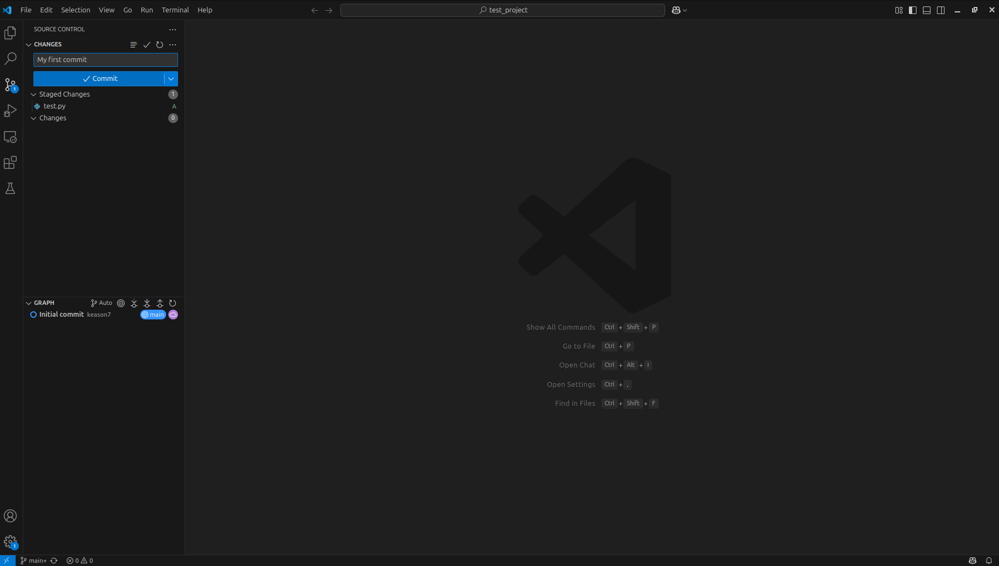

On peut maintenant commit avec un message de commit. Avant de commit, il est possible de voir tous les changements en ouvrant chaque fichier modifié.

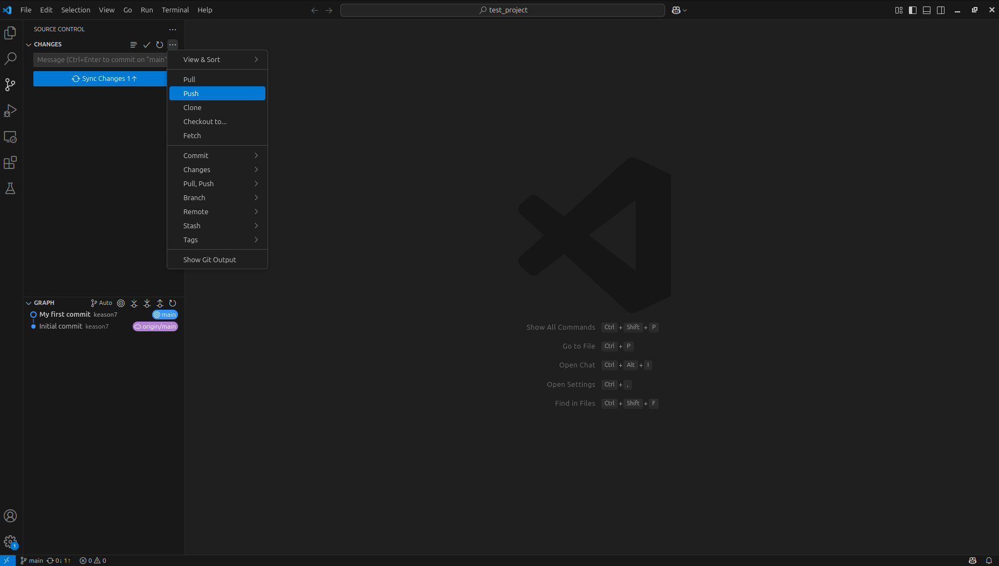

Puis quand tous les changements ont été vérifiés, on peut push vers le serveur distant.

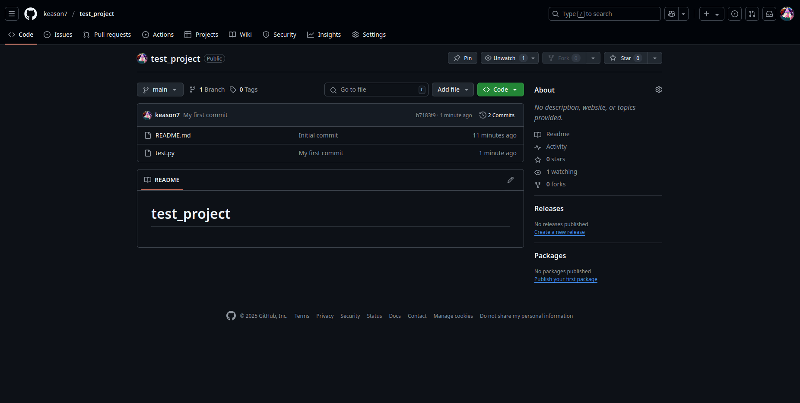
Les modifications ont été prises en compte sur le projet Git sur GitHub.

Nous pouvons maintenant supprimer le projet Git en local ainsi que le projet GitHub dans les paramètres du projet.
