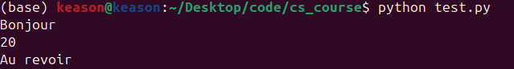

# Les variables et les types

Pour pouvoir donner des instructions à un ordinateur, il incombe au développeur d'écrire un algorithme. Un algorithme est une suite d'instructions logiques. De façon similaire à une recette de cuisine, les instructions sont exécutées ligne par ligne jusqu'à la fin du programme.

```python
print("Bonjour")
print(5 * 4)
print("Au revoir")
```

Les lignes sont exécutées unes à unes.



## Les variables

Lorsque l'on programme, on utilise constamment des variables. Une variable est un moyen de stocker une donnée dans un algorithme. Cette donnée stockée est réutilisable et modifiable partout dans l'algorithme.

```python
a = 5
print(a)
```

Ici, on a stocké la valeur `5` dans la variable nommée `a`.

On peut aussi stocker plusieurs valeurs et les manipuler.

```python
a = 5
b = 4
c = a * b
print(c)
```

En python on utilise le snake case. C'est une convention de nommage de variable:

```python
variable = 5
ma_variable = 5
```

Toutes les variables commencent par une minuscule et les espaces sont simulées par le signe `_`.

:x: Ne pas utiliser d'accents ou de signes spéciaux dans les noms de variables, commentaires, ...

```python
# a ne pas pas faire
résultat = 5

# valide
resultat = 5
```

## Les commentaires

Lorsque l'on écrit du code, il est très courant d'utiliser des commentaires. Les commentaires sont des ligne de code non exécutées par l'ordinateur et qui ont pour seul but de renseigner des informations à la lecture du code. Cela permet de comprendre plus vite le code à la lecture.

Ils sont déclarés en python par le signe `#` (un seul ligne) ou `""" """` (plusieures lignes).

```python
"""
J'écris ici un commentaire sur
plusieurs lignes.
"""

""" J'écris ici un commentaire sur une ligne. """

# stockage de la valeur dans a
a = 5
# stockage de la valeur dans b
b = 4

# multiplication de a et b et stockage dans c
c = a * b
# affichage du résultat via la variable c
print(c)
```

On peut modifier la valeur d'un variable au fur et à mesure de l'algorithme.

```python
# la valeur est 25
age = 25
# la valeur est 26
age = age + 1
```

Une autre manière plus courte de l'écrire.

```python
# la valeur est 25.0
age = 25.0

# la valeur est 26.0
age += 1

# la valeur est 25.0
age -= 1

# la valeur est 12.5
age /= 2

# la valeur est 25.0
age *= 2
```

## Les types

Les types permettent de catégoriser les valeurs contenues dans les variables d'un algorithme. Il existe des types natifs à python et des types "custom" qui l'on peut créer nous même (cf. programmation orientée objet).

Les types natifs principaux sont les suivant:

```python
# int
# represente les entiers: -1, -2, 0, 1, ...
ma_variable = 5

# float
# represente les flottants: -1.0, -1.1, ..., 0.0, 0.1, ...
ma_variable = 5.0

# complex
# represente les nombres complexes
ma_variable = complex(3, 5)

# bool
# represente les booleens (True ou False)
ma_variable = True

# NoneType
# represente les valeures null
ma_variable = None

# str (string)
# represente les chaines de caractere
ma_variable = "un texte"
```

On peut afficher le type d'une variable par la fonction `type`. On reviendra sur le terme fonction (cf. fonctions) et le terme class (cf. programmation orientée objet) plus tard.

```python
ma_variable = 5.0
# <class 'float'>
print(type(ma_variable))
```

Lors de l'écriture d'un algorithme on peut `caster` des variables, c'est-à-dire convertir le type.

```python
# on initialise la variable avec un float
ma_variable = 5.0

# on convertit le type de float vers int
# 5.0 devient 5
ma_variable = int(ma_variable)

# on convertit le type de int vers str
# 5 devient "5"
ma_variable = str(ma_variable)
```

## Les strings et la fonction print

On peut concaténer (fusionner) des chaînes de caractère.

```python
prenom = "Ronald"
nom = "Weasley"

# "Ronald Weasley"
identite = prenom + " " + nom
```

On peut aussi afficher des strings dans le terminal.

```python
# definitions des variables
prenom = "Ronald"
nom = "Weasley"
age = 25

# meme message de 3 façons différentes
print("Je m'appelle", prenom, nom, "et j'ai", age, "ans.")
print("Je m'appelle " + prenom + " " + nom + " et j'ai " + str(age) + " ans.")
print(f"Je m'appelle {prenom} {nom} et j'ai {age} ans.")
```

Voici quelques caractères spéciaux des chaînes de caractères:

- Saut de ligne: `\n`
- Tabulation: `\t`
- Backslash `\\`
- Délimiteur: `\'` ou `\"`

## Les opérateurs numérique

Voici les opérateurs principaux pour des valeures numériques

```python
# on declare deux variables
i = 21
j = 4

# operations elementaires
# a chaque ligne la variable resultat est ecrasee par une nouvelle valeur
resultat = i + j
resultat = i - j
resultat = i * j
resultat = i / j

# equivaut a 21⁴ = 194481
resultat = i ** j

# modulo, resultat est le reste de la division euclidienne
# 21 = 4 * 5 + 1
# resultat vaut 1 ici
resultat = i % j

# resultat est le quotient de la division euclidienne
# 21 = 4 * 5 + 1
# resultat vaut 5 ici
resultat = i // j
```

Seules les variables numériques permettent l'utilisation de ces opérateurs.

```python
x = "bonjour"
y = 5
x + y
```

Ce code retourne un erreur indiquant l'impossibilité d'additionner une chaîne de caractère avec un entier.

```bash
Traceback (most recent call last):
  File "<stdin>", line 1, in <module>
TypeError: can only concatenate str (not "int") to str
```

Il est plus pratique dans du code d'utiliser des noms de variables qui ont un sens au lieu de noms génériques comme `a` ou `b`. Cela permet d'éviter trop de commentaires et d'avoir du code lisible.

```python
pi = 3.14159
radius = 2.2
area = pi * (radius ** 2)
```

## La fonction main

Lorsque que l'on écrit le script principal (celui qui va être lancé par l'utilisateur), il est courant d'écrire le code de la façon suivante.

### test.py

```python
# definition de la fonction main (fonction principale)
def main():
    print("Hello world")

# impose que l'execution de main() se fasse uniquement si ce script est lancé de façon direct: python test.py
if __name__=="__main__":
    main()
```

La variable `__name__` est une variable spéciale de python dont la valeur est automatiquement déterminée en fonction de la façon dont un script est exécuté.

Ici la valeur de `__name__` est `"__main__"` car c'est le script que l'on va lancer.

Si l'on crée un nouveau fichier `test1.py` et que l'on modifie le code:

### test1.py

```python
print(__name__)
```

### test.py

```python
import test1

def main():
    print(__name__)

if __name__=="__main__":
    main()
```

On retrouvera dans le terminal:

```bash
test_1
__main__
```

`__name__` est seulement égal à `"__main__"` pour le fichier exécuté directement mais vaudra une autre valeur pour les fichiers importés.
