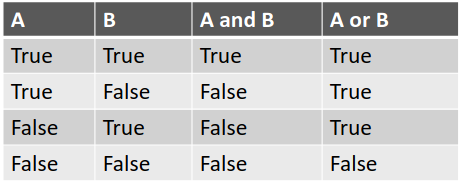

# Les conditions et les boucles

## Les opérateur de comparaison

Pour comparer des variables on peut utiliser des opérateurs de comparaison.

```python
i = 20
j = 10

# test si i est supérieur à j
# produit la valeur True de type bool
i > j

# test si i est supérieur ou égal à j
# produit la valeur True de type bool
i >= j

# test si i est inférieur à j
# produit la valeur False de type bool
i < j

# test si i est inférieur ou égal à j
# produit la valeur False de type bool
i <= j

# test si i est égal à j
# produit la valeur False de type bool
i == j

# test si i est différent de j
# produit la valeur True de type bool
i != j
```

:x: `=` est différent de `==`. Dans le premier cas on attribue une valeur à une variable et dans le deuxième on teste l'égalité.

On peut stocker la valeur d'une comparaison dans une variable.

```python
i = 20
j = 10

is_i_superior_to_j = i > j
```

## Les opérateur logiques

De la même façon on peut utiliser des opérateurs logiques.

```python
i = 20
j = 10

# True
is_i_superior_to_j = i > j

# False
is_i_inferior_to_j = i < j


# not inverse la valeur de la variable
# si la variable vaut True, alors cette assertion vaudra False
not is_i_superior_to_j

# l'assertion vaut True si les deux variables sont à True
is_i_superior_to_j and is_i_inferior_to_j

# l'assertion vaut True si au moins une des deux variables (ou les deux) est à True
is_i_superior_to_j and is_i_inferior_to_j
```

Voici un tableau récapitulatif.\


## Les conditions

Afin de pouvoir prévoir plusieurs cas de figure dans un algorithme on utilise les conditions. On va déclarer:

- Un `if` avec une condition. Si cette condition est vraie, le code s'exécute.
- Un ou plusieurs `elif` optionnel(s). Cela permet de créer d'autres cas de figures spécifiques.
- Un `else` optionnel qui prend en charge tous les autres cas de figure lorsque le ou les blocs conditionnels précédents ne sont pas vrais (`if`, `elif`).

```python
i = 20
j = 10

if i > j:
    print("i est plus grand que j")
elif i == j:
    print("i est égal à j")
else:
    print("i est moins grand que j")
```

On peut aussi faire des blocs plus simples.

```python
i = 20
j = 10

if i > j:
    print("i est plus grand que j")
```

Ou bien des blocs imbriqués.

```python
i = 20
j = 10

if i > j:
    print("i est plus grand que j")
    if i == 10:
        print("i vaut 10")
```

## Les boucles

### La boucle for

La boucle for exécute le code un nombre de fois défini. En programmation, il est au final assez rare de ne pas savoir à l'avance combien de fois une action doit être répétée, c'est pourquoi c'est le type de boucle le plus utilisé.

```python
# Pour i allant de 0 à 4 avec un pas de 1
# i va valoir 0, puis 1, puis 2, puis 3, puis 4
for i in range(0, 5, 1):
    # afficher la valeur de i
    print(f"i vaut {i}")
```

La variable i agit comme compteur.

La fonction range prend en argument:

- une valeur minimale
- une valeur maximale (non incluse)
- un pas d'incrémentation

Cependant les valeurs par défaut pour la valeur de départ et le pas sont 0 et 1. Donc on utilise souvent une version plus courte pour écrire la boucle.

```python
for i in range(5):
    print(f"i vaut {i}")
```

Sortie dans le terminal:

```bash
n vaut 0
n vaut 1
n vaut 2
n vaut 3
n vaut 4
```

### La boucle while

```python
i = 0
while i < 5:
    print(f"i vaut {i}")
    i = i + 1
```

Sortie dans le terminal:

```bash
n vaut 0
n vaut 1
n vaut 2
n vaut 3
n vaut 4
```

La boucle `while` (tant que) permet d'exécuter le code tant que la condition est vraie. Ici, tant que la valeur n est inférieur à 5, on continue à exécuter le code dans la boucle.

Ces boucles sont à utiliser le moins possible car on préfèrera toujours utiliser les boucles `for`. En effet il faut toujours bien réfléchir à une condition d'arrêt ce qui peut provoquer des bugs et la boucle `for` produit souvent du code plus simple à lire. Autrement dit on peut souvent remplacer une boucle `while` par une boucle `for`, mais dans certains cas de figure, la boucle `while` est la seule solution car on ne sait pas combien de fois l'action est répétée. Par exemple, dans un jeu vidéo, par défaut, l'utilisateur continue de jouer tant qu'il n'a pas explicitement quitté.

Par exemple, cette boucle ne s'arrête jamais.

```python
while True:
    print("This never ends ...")
```

### break et continue

Avec le mot clé on peut forcer le fait de sortir d'une boucle (`for`, `while`).

```python
for i in range(5):
    # si i vaut 3, on force la sortie de la boucle for
    if i == 3:
        break
    print(f"i vaut {i}")
```

```python
i = 0
while i < 5:
    # si i vaut 3, on force la sortie de la boucle while
    if i == 3:
        break
    print(f"i vaut {i}")
    i = i + 1
```

Sortie dans le terminal pour les deux exemples:

```bash
n vaut 0
n vaut 1
n vaut 2
```

---

Avec continue, on peut passer une itération d'une boucle (`for` ou `while`).

```python
for i in range(5):
    # si i vaut 3, for n'execute pas le code après le if, et on passe directement à l'itération de boucle suivante
    if i == 3:
        continue
    print(f"i vaut {i}")
```

Sortie dans le terminal:

```bash
i vaut 0
i vaut 1
i vaut 2
i vaut 4
```

| For                                                        | While                                                                              |
| :--------------------------------------------------------- | :--------------------------------------------------------------------------------- |
| Nombre connu d'itérations                                  | Nombre illimité d'itérations                                                       |
| Peut se terminer plus tôt via break                        | Peut se terminer plus tôt via break                                                |
| Peut skip une itération avec continue                      | Peut skip une itération avec continue                                              |
| Utilise un compteur                                        | Peut utiliser un compteur mais doit être déclaré avant et incrémenté à l'intérieur |
| Peut réécrire une boucle for en utilisant une boucle while | Peut ne pas être en mesure de réécrire une boucle while à l'aide d'une boucle for  |
