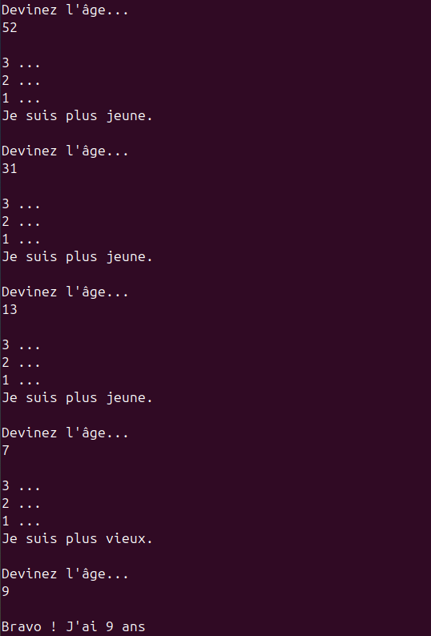

# TP Devine mon âge

## Exercice

Le but de ce TP est d'écrire un programme qui demande à l'utilisateur de deviner un âge.

- Le programme choisi un âge entre un âge minimum et maximum.
- Il demande à l'utilisateur de deviner l'âge.
- Puis il compare avec l'âge choisi et indique si c'est plus ou moins.
- A chaque fois qu'il indique si c'est plus ou moins, le programme doit afficher un compte à rebours: "3 ...", "2 ...", "1 ..." puis donner la réponse. L'intervalle de temps dans le compte à rebours est de 1 seconde.
- Le programme continue de tourner tant que l'utilisateur n'a pas trouvé l'âge.
- Lorsque l'utilisateur trouve l'âge, le programme le félicite et il s'arrête.

Pour réaliser ce TP:

- Ce projet doit être créé dans un projet Git.

- La fonction `main` doit être utilisée.

- Pour gérer l'interval de 1 seconde et le choix d'un nombre aléatoire on peut utiliser ces fonctions:

  ```python
  import random
  import time

  random.randint
  time.sleep
  ```

En informatique, l'aléatoire n'existe pas vraiment. Il est possible de générer des vrai processus aléatoires via des éléments externes mesurés par [capteurs](https://ieeexplore.ieee.org/document/7495500) qui fournissent des données permettant le vrai aléatoire. Mais algorithmiquement, on utilise des [générateurs pseudo-aléatoire](https://fr.wikipedia.org/wiki/G%C3%A9n%C3%A9rateur_de_nombres_al%C3%A9atoires). Ce type d'algorithmes prend un nombre en entrée (seed) et applique une suite d'opérations permettant de générer un suite de nombre n'ayant aucun lien calculatoire entre eux. Mais si l'on connaît la seed, on connaît la suite. Par exemple, avec `random.randint`, si on force la seed à une valeur (ex: seed=42), à chaque relance du programme on aura le même nombre aléatoire. C'est donc un algorithme déterministe, c'est-à-dire un algorithme qui, étant donné une entrée particulière, produira toujours la même sortie.

### Exemple



## Solution

```python
import random
import time


def main():
    # ages minimums et maximums
    age_min = 0
    age_max = 77

    # choose an int between age_min et age_max included
    age_target = random.randint(age_min, age_max)

    # while loop stop condition
    age_found = False

    # while the target age has not been found, do the loop
    while not age_found:
        # user choose an age
        age_guess = input("Devinez l'âge...\n")
        print()

        # convert str to float and then to int
        # if we convert directly to int the program crash when the user
        # enter something like: 25.0 as it is a float
        # int(float()) ensure that 25 or 25.0 strings are converted to int
        age_guess = int(float(age_guess))

        # the target age is higher than the guess
        if age_target > age_guess:
            # display "3 ...", "2 ...", "1 ..." with 1s interval
            # before giving a clue about the target age
            for i in range(3):
                print(f"{3 - i} ...")
                time.sleep(1)

            # display clue about target age
            print("Je suis plus vieux.\n")

        # the target age is lower than the guess
        elif age_target < age_guess:
            # display "3 ...", "2 ...", "1 ..." with 1s interval
            # before giving a clue about the target age
            for i in range(3):
                print(f"{3 - i} ...")
                time.sleep(1)

            # display clue about target age
            print("Je suis plus jeune.\n")

        # the target age is not higher or lower so we found the correct age
        else:
            # user found target age, we can stop the while loop and display the target age
            age_found = True
            print(f"Bravo ! J'ai {age_target} ans")


if __name__ == "__main__":
    main()
```
