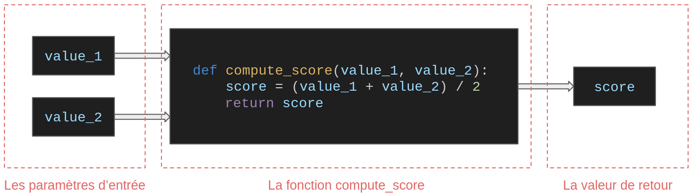

# Les fonctions

## Besoin d'abstraction

Lors de l'écriture d'un programme, il peut devenir très fastidieux de relire et comprendre simplement le programme au fur et à mesure du développement. En effet, plus on augmente le nombre de lignes de code, plus la lecture devient complexe. De plus, cela peut amener à dupliquer certaines zones de code, rendant la lecture fastidieuse.



Afin de pouvoir simplifier le code, on utilise des fonctions. Une fonction est une suite d'instructions que l'on peut appeler avec un nom. Lors des précédents TP, nous avons déjà utilisé des fonctions comme `print()`, `range()`, `random.randint()` ou bien `time.sleep()`. Une fonction permet d'abstraire du code, par exemple nous n'avons pas besoin de copier coller le code de la fonction `print()`, on peut juste l'appeler dans notre code.

Imaginons que l'on veut appliquer plusieurs fois le même traitement à des variables. On va devoir dupliquer le code ce qui rend la lecture indigeste.

```python
i = 20
j = 10

k = 15
l = 5

if i > j:
    print(f"{i} est plus grand que {j}")
elif i == j:
    print(f"{i} est égal à {j}")
else:
    print(f"{i} est moins grand que {j}")


if k > l:
    print(f"{k} est plus grand que {l}")
elif k == l:
    print(f"{k} est égal à {l}")
else:
    print(f"{k} est moins grand que {l}")
```

A la place on peut créer et appeler une fonction:

```python
# definition de la fonction
def compare_numbers(x, y):
    if x > y:
        print(f"{x} est plus grand que {y}")
    elif x == y:
        print(f"{x} est égal à {y}")
    else:
        print(f"{x} est moins grand que {y}")

# appels de la fonction
compare_numbers(20, 10)
compare_numbers(15, 5)
```

Ici, on abstrait le code c'est-à-dire que l'on a réduit la complexité afin d'obtenir une conception et une implémentation plus efficace.

## Les fonctions en python

```python
def is_even(x):
    """Return True if the number is even or False if the number is odd.

    Args:
        x (int): Input number.

    Returns:
        bool: True (even number) or False (odd number).
    """
    # x % 2 computes the remainder when x is divided by 2
    # even: remainder is 0
    # odd: remainder is 1
    return x % 2 == 0


print(is_even(0))
print(is_even(1))
print(is_even(2))
print(is_even(3))
```

- `def` permet de déclarer une fonction.
- `is_even` est le nom de la fonction.
- `(x)` est le paramètre de la fonction. Il est possible d'avoir plus de paramètres par exemple `(variable_1, variable_2, variable_3)`. On peut aussi avoir 0 paramètres.
- Le texte en commentaire via `""" """` est la docstring. C'est un texte permettant de décrire et documenter la fonction (entrée(s), sortie(s), types, ce qui la fonction fait).
- `return` permet de retourner un résultat au code qui appelle la fonction. Une fonction sans `return` retourne `None` par défaut.

Autres caractéristiques:

- La variable `x` ainsi que le contenu de fonction n'est accessible que dans fonction.
- Il est possible d'avoir des paramètres par défaut.

```python
def print_identity(first_name="Ronald", name="Weasley"):
    # creation d'une variable
    # elle est seulement accessible dans la fonction
    une_variable_locale_a_la_fonction = 38
    print(une_variable_locale_a_la_fonction)

    # affichage des parametres
    # les parametres sont seulement accessible dans la fonction
    print(f"Vous vous appelez {first_name} {name}\n")

# ces trois appels fonctionnent
print_identity("Renaud", "Jarrossay")
print_identity(first_name="Renaud", name="Jarrossay")
print_identity()

# l'appel d'une des deux variables en dehors du code fait crash le programme
print(first_name, une_variable_locale_a_la_fonction)
```

Sortie du terminal:

```bash
38
Vous vous appelez Renaud Jarrossay

38
Vous vous appelez Renaud Jarrossay

38
Vous vous appelez Ronald Weasley

Traceback (most recent call last):
  File "/home/keason/Documents/code/cs_course/test.py", line 16, in <module>
    print(first_name, une_variable_locale_a_la_fonction)
        ^^^^^^^^^^
NameError: name 'first_name' is not defined
```

## Cas spécifiques

On peut aussi passer les fonctions en argument.

```python
def function_a():
    print("inside function_a")


def function_b(y):
    print("inside function_b")
    return y


def function_c(z):
    print("inside function_c")
    return z()

# la fonction function_a affiche un message et retourne None
print(function_a())

# la fonction function_b affiche un message et retourne 5 + 2
print(5 + function_b(2))

# la fonction function_c execute la fonction function_a
# deux messages sont affichés et la fonction function_c retourne None
print(function_c(function_a))
```

Sortie du terminal:

```bash
inside function_a
None
inside function_b
7
inside function_c
inside function_a
None
```

---

On peut aussi créer des fonctions à l'intérieur de fonctions. Ici, la fonction `clean_input` est utilisée seulement dans `compute_area`.

```python
# fonction principale
def compute_area(width, height):

    # fonction secondaire seulement utilisée dans compute_area
    def clean_input(value):
        # si la valeur d'entrée est str (string)
        if isinstance(value, str):
            # suppression des espaces
            value = value.strip()
            # conversion en float
            value = float(value)
        # retourne la valeur nettoyée et convertie
        return value

    # nettoie et convertit les paramètres de compute_area
    # avec la fonction secondaire
    cleaned_width = clean_input(width)
    cleaned_height = clean_input(height)

    # calcule de surface
    area = cleaned_width * cleaned_height

    # retourne la surface
    return area


print(compute_area("  10 ", "20 "))
```

Sortie du terminal:

```bash
200.0
```

Aussi on peut créer un fonction qui initialise une fonction et la retourne. La fonction `make_multiplier` crée une fonction spécifique à l'aide de `factor` et la renvoie pour qu'elle soit utilisée.

```python
# fonction principale
def make_multiplier(factor):
    # fonction secondaire
    # on peut acceder à factor de la fonction principale
    def multiply(number):
        return number * factor

    # on retourne une fonction initialisee par
    # le paramètre de factor de make_multiplier
    return multiply


# factor == 3 donc make_multiplier va retourner une fonction
# qui multiplie par 3 le nombre en entrée
# triple n'est donc pas une variable, mais une fonction
# qui multiplie par 3
triple = make_multiplier(3)

# la fonction executee ici est:
# def multiply(number):
#     return number * 3
print(triple(5))
```

Sortie du terminal:

```bash
15
```

## Les fonction récursives

Nous avons vu qu'une fonction doit être déclarée puis appelée.

```python
# declaration
def my_function():
	print("Hello")

# appel
my_function()
```

Cependant il est aussi possible qu'une fonction s'appelle elle-même. On parle alors de fonction récursive. Ce sont généralement des fonctions plus difficiles à coder car il s'agit de bien comprendre la logique de la fonction et certains cas d'applications ne sont pas fait pour être codés en récursif.

On va s'intéresser au fait de calculer une somme des chiffres de 1 à n. Par exemple, si `n = 6`, la fonction devra calculer la somme suivante: `1 + 2 + 3 + 4 + 5 + 6`.

Dans la méthode classique on fait une boucle de 1 à n inclus et à chaque itération on ajoute la valeur i au résultat. La variable i vaut 1 à la première itération, 2 à la deuxième, ...

```python
def sum_classic(n):
    # resultat de la somme
    result = 0
    # iteration de i=1 à i=n inclus
    for i in range(1, n + 1, 1):
        # ajout de i au resultat
        result += i
    return result

# 3 + 2 + 1 = 3
print(sum_classic(3))
```

Dans la fonction récursive, elle va s'appeler elle-même.

```python
def sum_recursive(n):
    # condition d'arret: si on arrive a 1 on ne peut plus appeler la fonction car on renvoie n
    # sans cette condition on essayerait ensuite d'appeler sum_recursive(0), sum_recursive(-1), sum_recursive(-2), ...
    # cela produirait une boucle d'appels infinie
    if n == 1:
        return n
    # cas normal: on appelle sum_recursive avec n - 1
    return n + sum_recursive(n - 1)

# 3 + 2 + 1 = 3
print(sum_recursive(3))
```

Voilà ce qui se passe étape par étape:

- sum_recursive(3) appelle sum_recursive(2).
- sum_recursive(2) appelle sum_recursive(1).
- sum_recursive(1) renvoie 1 (condition d'arrêt). sum_recursive ne peut plus être appelée car on a renvoyé n.
- sum_recursive(2) peut retourner 2 + 1 = 3
- sum_recursive(3) peut retourner 3 + 3 = 6.

A retenir:

- Une fonction récursive est une fonction qui s'appelle elle-même.
- On doit toujours définir une condition d'arrêt afin que la fonction ne s'appelle pas elle-même à l'infini.
- Les fonctions récursives peuvent être très efficaces mais imposent une logique de code plus complexe.
- Certains cas d'usages permettent peu l'écriture de fonctions récursives.
