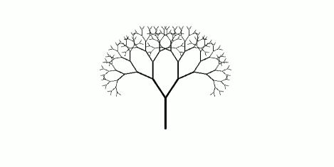

# TP Fractale

## Présentation

Une figure fractale est un objet mathématique qui présente une structure similaire à toutes les échelles. En zoomant sur une partie de la figure, il est possible de retrouver toute la figure, on dit alors qu’elle est « autosimilaire ». Plusieurs autres conditions que l'autosimilarité permettent de catégoriser une fractale. Cependant, les figures fractales n'ont pas à satisfaire toutes ces propriétés pour servir de modèles. Il leur suffit de réaliser des approximations convenables quant aux règles établies. On retrouve des exemples de formes fractales dans la nature comme le choux romanesco.


En zoomant à l'infini, on retrouve des formes similaires.


Durant ce TP nous allons utiliser la bibliothèque `Turtle` afin de pouvoir dessiner.


Turtle est une bibliothèque permettant de créer des GUI, c'est-à-dire des interfaces graphiques. Avec turtle, nous allons pouvoir créer une fenêtre et dessiner dedans à l'aide de suite d'instruction.

Quelques fonctions utiles:

```python
from turtle import Screen, Turtle

# cree une fenetre
screen = Screen()
# regle la taille de la fenetre
screen.setup(width, height)
# lance la fenetre
screen.mainloop()

# cree une turtle permettant de dessiner
turtle = Turtle()
# cache le pointeur en forme de tortue
turtle.hideturtle()
# regle la vitesse de dessin
turtle.speed(speed)

# met à jour la couleur du crayon (tortue)
turtle.color("red")
# met à jour la largeur du trait
turtle.width(branch_width)

# change la direction du crayon par une rotation vers la droite
turtle.right(angle)
# change la direction du crayon par une rotation vers la gauche
turtle.left(angle)
# avance le crayon pour tracer un trait d'une certaine distance
turtle.forward(distance)
# recule le crayon pour tracer un trait d'une certaine distance
turtle.backward(distance)
```

### Exemple

```python
turtle.forward(100)
turtle.left(20)
turtle.forward(100)
```

Ce code produit ce dessin: \


- Dessiner un trait de 100 vers l'avant
- Faire une rotation de 20° vers la gauche
- Dessiner un trait de 100 vers l'avant

Pour réaliser ce TP:

- On va créer un environnement conda appelé `fractal`. On y installera python, pip et turtle en deux commandes. Puis on utilisera cet environnement dans VSCode.

  ```bash
  conda install python pip
  pip install PythonTurtle
  ```

- Ce projet doit être créé dans un projet Git.

- La fonction `main` doit être utilisée.

## Exercice 1.1

Créer une fonction `initialize_screen` qui initialise une fenêtre turtle avec une taille et lancer la fenêtre dans le code.

## Exercice 1.2

Ajouter au code existant une fonction `initialize_turtle` qui initialise une crayon turtle, cache le pointeur et règle la vitesse de dessin.

## Exercice 1.3

On va maintenant s'intéresser à dessiner la `canopée fractale`.



Une canopée fractale est créée en divisant un segment de ligne en deux segments plus petits à ses extrémités, puis en divisant également les deux segments plus petits, et ainsi de suite, à l'infini.

Une canopée fractale a les trois propriétés suivantes:

- L'angle entre deux segments de ligne voisins est le même dans toute la fractale.
- Le rapport des longueurs de deux segments de ligne consécutifs est constant.
- La figure entière est un graphe, c'est-à-dire que chaque branche est connectée à la branche de son niveau précédant.

Écrire la fonction suivante permettant le dessin de la canopée fractale.

```python
def fractal_canopy(turtle, branch_length, branch_width, ratio, depth, angle):
    ...
```

### Conseil

C'est une fonction récursive.
