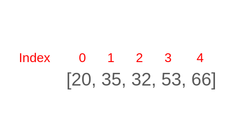

# Listes, tuples et dictionnaires

Les listes, tuples et dictionnaires sont des éléments essentiels de la programmation. Ces structures permettent de stocker des séquences de données et facilitent grandement le développement informatique. Comme les `int`, `float` ou `str`, ces trois structures sont des types natifs à python.



## Les tuples

Un tuple est une séquence ordonnée d'éléments, pouvant mélanger des types d'éléments différents.

```python
# initialisation d'un tuple vide
mon_tuple_vide = ()

# initialisation d'un tuple non vide
mon_tuple = (2, "Ronald", 3.0)

# affichage de l'element 1 du tuple
# affiche "Ronald"
print(mon_tuple[1])

# concatenation de deux tuples (fusion)
# affiche (2, 'Ronald', 3.0, 5, 6)
print(mon_tuple + (5, 6))

# coupe le tuple (slice)
# affiche ('Ronald',)
# une virgule en plus comme ici indique un tuple avec 1 seul element
print(mon_tuple[1:2])

# coupe le tuple (slice)
# affiche (2, 'Ronald')
print(mon_tuple[0:2])

# coupe le tuple (slice)
# affiche (2,)
print(mon_tuple[:1])

# calcul la longueur du tuple avec la fonction len
# affiche 3
print(len(mon_tuple))

# fait crash le code, un tuple est immuable, c'est a dire que
# l'on ne peut pas changer une valeur stockee apres declaration
# du tuples
mon_tuple[1] = 4

# declaration d'un tuple imbrique
mon_tuple_imbrique = ((1, 2), (3, 4), (5, 6))

# affiche (1, 2)
print(mon_tuple_imbrique[0])

# affiche 2
print(mon_tuple_imbrique[0][1])

# fait crash le code car l'index 2 n'existe pas
print(mon_tuple_imbrique[0][2])
```

Les tuples permettent donc de stocker des séquences de données. Certains cas d'utilisations sont très utiles:

### Échange de valeur de deux variables

```python
# cas de base
temp = x
x = y
y = temp

# avec les tuples
(x, y) = (y, x)
```

### Zip

Un fonction utile pour joindre des tuples.

```python
prenoms = ("Ronald", "Hermione", "Harry")
noms = ("Weasley", "Granger", "Potter")

# produit un type zip
# on peut donc le caster vers un tuple ou autre
identite = tuple(zip(prenoms, noms))

# (('Ronald', 'Weasley'), ('Hermione', 'Granger'), ('Harry', 'Potter'))
print(identite)

# et meme faire une boucle
# Ronald Weasley
# Hermione Granger
# Harry Potter
for un_nom, un_prenom in zip(noms, prenoms):
    print(un_prenom, un_nom)

# on peut inverser le processus
# l'operateur * supprime le premier tuple et donne chaque pair a zip
# 1 - tuple initial) (('Ronald', 'Weasley'), ('Hermione', 'Granger'), ('Harry', 'Potter'))
# 2 - operateur *)   ('Ronald', 'Weasley') ('Hermione', 'Granger') ('Harry', 'Potter')
# 3 - zip)           ('Ronald', 'Hermione', 'Harry') et ('Weasley', 'Granger', 'Potter')
prenoms_unpacked, noms_unpacked = zip(*identite)

# conversion zips en tuples
prenoms_unpacked = tuple(prenoms_unpacked)
noms_unpacked = tuple(noms_unpacked)

# ('Ronald', 'Hermione', 'Harry')
print(prenoms_unpacked)
# ('Weasley', 'Granger', 'Potter')
print(noms_unpacked)
```

### Retour de plus d'une valeur dans une fonction

```python
def ma_fonction(x, y):
    ...
    return (x, y)

(valeur_1, valeur_2) = ma_fonction(4, 5)
```

### Itération sur les tuples

On peut utiliser des boucles pour itérer sur un tuple.

```python
mon_tuple = (1, 2, 3, 4, 5)

for i in range(len(mon_tuple)):
    print(mon_tuple[i])

for valeur in mon_tuple:
    print(valeur)
```

Même sortie dans le terminal:

```bash
1
2
3
4
5
```

## Les listes

Une liste est une structure très similaire à un tuple mais la différence principale est la possibilité de modifier son contenu après initialisation.

```python
# initialisation d'une liste vide
ma_liste_vide = []

# initialisation d'une liste non vide
ma_liste = [1, 2, 3, 4, "Ronald", [38, 39]]

# affichage de l'element 1 de la liste
# affiche 2
print(ma_liste[1])

# concatenation de deux listes (fusion)
# affiche [1, 2, 3, 4, 'Ronald', [38, 39], 5, 6]
print(ma_liste + [5, 6])

# coupe la liste (slice)
# affiche [2]
print(ma_liste[1:2])

# coupe la liste (slice)
# affiche [2, 3]
print(ma_liste[1:3])

# coupe la liste (slice)
# affiche [2, 3, 4, 'Ronald', [38, 39]]
print(ma_liste[1:])

# calcul la longueur de la liste avec la fonction len
# affiche 6
print(len(ma_liste))

# changement de la valeur a l'index 1
# la liste devient [1, 58, 3, 4, 'Ronald', [38, 39]]
ma_liste[1] = 58

# affiche [38, 39]
print(ma_liste[5])

# affiche 39
print(ma_liste[5][1])

# fait crash le code car l'index 2 n'existe pas
print(ma_liste[5][2])
```

Quelques fonctions utiles:

```python
ma_liste = [3, 2, 1]

# ajoute la valeur 4 a la fin de la liste
# [3, 2, 1, 4]
ma_liste.append(4)

# ajoute la valeur 38 a la l'index 0
# [38, 3, 2, 1, 4]
ma_liste.insert(0, 38)

# etend la liste avec [32, 33, 34]
# [38, 3, 2, 1, 4, 32, 33, 34]
ma_liste.extend([32, 33, 34])

# supprime la premiere valeur trouvee qui est egale a 32
# [38, 3, 2, 1, 4, 33, 34]
ma_liste.remove(32)

# supprime la valeur a l'index 2
# [38, 3, 1, 4, 33, 34]
ma_liste.pop(2)

# supprime la derniere valeur
# [38, 3, 1, 4, 33]
ma_liste.pop()

# inverse la liste
# [33, 4, 1, 3, 38]
ma_liste.reverse()

# trie dans l'ordre croissant
# [1, 3, 4, 33, 38]
ma_liste.sort(reverse=False)

# trie dans l'ordre decroissant
# [38, 33, 4, 3, 1]
ma_liste.sort(reverse=True)
```

### Itération sur les listes

De la même manière qu'un tuple, on peut itérer sur une liste.

```python
ma_liste = [1, 2, 3, 4, 5]

for i in range(len(ma_liste)):
    print(ma_liste[i])

for valeur in ma_liste:
    print(valeur)
```

Même sortie dans le terminal:

```bash
1
2
3
4
5
```

### Les one-liner

Lors d'itération sur des listes, le langage python propose une simplification de la syntaxe: il est possible d'écrire une boucle en une ligne seulement.

```python
fois_deux = []

for i in range(5):
    fois_deux.append(i * 2)

# [0, 2, 4, 6, 8]
print(fois_deux)


fois_deux = [i * 2 for i in range(5)]
# [0, 2, 4, 6, 8]
print(fois_deux)
```

Les one-liner permettent de réduire la taille du code mais dans certains cas d'usages ils ne permettent pas d'améliorer la lisibilité et la compréhension du code. Il faut donc les utiliser avec parcimonie et dans des cas simples pour produire du code facilement lisible.

## Les chaînes de caractère

Une chaîne de caractère peut être vue comme une liste ou un tuple. Cependant elles sont immuables comme les tuples.

```python
identite = "Ronald Weasley"

# affiche R
print(identite[0])

# affiche o
print(identite[1])

# affiche 14
print(len(identite))

# crash le code car les chaines de caractere sont immuable
identite[0] = "y"
```

On peut aussi iterer dessus comme une liste ou un tuple.

```python
s = "abcdefgh"

for index in range(len(s)):
    if s[index] == "b" or s[index] == "u":
        print("There is an b or u")

for char in s:
    if char == "b" or char == "u":
        print("There is an b or u")
```

Même sortie dans le terminal.

```bash
There is an b or u
There is an b or u
```

## Le slicing

Les listes, tuples et chaînes de caractères sont sujet au slicing.

```text
ma_variable[start:stop:step] avec step=1 par défaut
```

```python
s = "abcdefgh"
s[3:6] # "def", meme chose que s[3:6:1]
s[3:6:2] # "df"
s[::] # "abcdefgh", meme chose que s[0:len(s):1]
s[::-1] # "hgfedbca"
s[4:1:-2] # "ec"
```

## Les dictionnaires

Une autre structure de données très utilisée est le dictionnaire. Un dictionnaire permet de stocker des valeurs accessibles non par index (listes et tuples) mais par clés.

Imaginons que nous voulons stocker des informations sur les élèves d'une classe.

```python
def get_eleve(nom, noms, prenoms, ages, notes, matieres_favorites):
    index = noms.index(nom)

    prenom = prenoms[index]
    age = ages[index]
    note = notes[index]
    matiere_favorite = matieres_favorites[index]

    return (nom, prenom, age, note, matiere_favorite)


noms = ["Weasley", "Granger", "Potter"]
prenoms = ["Ronald", "Hermione", "Harry"]
ages = [16, 16, 15]
notes = [11, 20, 13]
matieres_favorites = ["Quidditch", "Potions", "Défense contre les forces du mal"]

# ('Weasley', 'Ronald', 16, 11, 'Quidditch')
print(get_eleve("Weasley", noms, prenoms, ages, notes, matieres_favorites))
```

Avec des listes, cela peut devenir compliqué car on a beaucoup de listes à maintenir. Pour utiliser une fonction on doit faire déclarer beaucoup d'arguments. Cela peut générer des structures complexes à maintenir dans du code. Si on change quelque chose dans une liste il peut être possible de devoir actualiser toutes les listes au bon index.

Avec les dictionnaires, on peut faire plus simple.

```python
mon_dict = {
    "Weasley": ("Ronald", 16, 11, "Quidditch"),
    "Granger": ("Hermione", 16, 20, "Potions"),
    "Potter": ("Harry", 15, 13, "Défense contre les forces du mal"),
}


def get_eleve(cle, dictionnaire):
    return (cle,) + dictionnaire[cle]

# ('Weasley', 'Ronald', 16, 11, 'Quidditch')
print(get_eleve("Weasley", mon_dict))
```

Chaque entrée de dictionnaire est une clé (on peut utiliser plusieurs types comme les `str` ou les `int`). On accède directement avec la clé et on récupère la valeur ici un tuple. Il n'y a pas d'utilisation de plusieurs listes mais seulement d'une seule structure de données ce qui simplifie le code.

Ici on pourrait aussi faire un dictionnaire imbriqué.

```python
mon_dict = {
    "Weasley": {
        "prenom": "Ronald",
        "age": 16,
        "note": 11,
        "matiere_favorite": "Quidditch",
    },
    "Granger": {
        "prenom": "Hermione",
        "age": 16,
        "note": 20,
        "matiere_favorite": "Potions",
    },
    "Potter": {
        "prenom": "Harry",
        "age": 15,
        "note": 13,
        "matiere_favorite": "Défense contre les forces du mal",
    },
}


def get_eleve(cle, dictionnaire):
    # recupere l'eleve
    eleve = dictionnaire[cle]

    # ajoute le nom au dictionnaire
    # a la place de | on aurait pu faire
    # eleve.update({"nom": cle})
    # return eleve
    return {"nom": cle} | eleve

# {'nom': 'Weasley', 'prenom': 'Ronald', 'age': 16, 'note': 11, 'matiere_favorite': 'Quidditch'}
print(get_eleve("Weasley", mon_dict))
```

### Manipulation des dictionnaires

```python
matieres_favorites = {"Weasley": "Quidditch", "Granger": "Potions", "Potter": "Défense contre les forces du mal"}

# acces au contenu de la cle "Weasley"
# affiche "Quidditch"
print(matieres_favorites["Weasley"])

# retourne une erreur car la cle n'est pas dans le dictionnaire
# print(matieres_favorites["Jarrossay"])

# ajout d'une entree dans le dictionnaire
matieres_favorites["Roger"] = "Divination"

# test si la cle est dans le dict
# affiche True
print("Roger" in matieres_favorites)

# test si la cle est dans le dict
# affiche False
print("Jarrossay" in matieres_favorites)

# supprime une entree du dictionnaire
del matieres_favorites["Roger"]

# retourne les cles du dictionnaire
# dict_keys(['Weasley', 'Granger', 'Potter'])
print(matieres_favorites.keys())

# si on veut une list, on peut caster le type
# ['Weasley', 'Granger', 'Potter']
print(list(matieres_favorites.keys()))

# retourne les valeurs du dictionnaire
# dict_values(['Quidditch', 'Potions', 'Défense contre les forces du mal'])
# comme pour les cles, on peut caster le type
print(matieres_favorites.values())
```

Les dictionnaires n'ont que des clés uniques et les clés ne sont pas forcément ordonnées.
