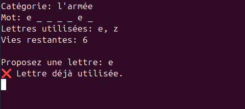

# TP Jeu du pendu

## Exercice

Le pendu est un jeu consistant à trouver un mot en devinant quelles sont les lettres qui le composent.

### Déroulement

- Un mot aléatoire est choisi par le programme. Pour chaque mot, une catégorie est associée qui servira d'indice. Par exemple : `mot="ordinateur"` et `catégorie="objet"`.
- L'utilisateur dispose d'un nombre de vies.
- Le programme donne la longueur du mot à deviner au début.
- Si l'utilisateur n'a plus de vie: c'est perdu.
- Si l'utilisateur devine toutes les lettres: c'est gagné.

- A chaque tour:

  - Le mot avec seulement les lettres devinées sont affichées ainsi que la catégorie, les lettre précédemment utilisées et le nombre de vies.

  - L'utilisateur choisit une lettre. La validité du choix est vérifiée. Si le choix est valide, on continue le code, sinon on redemande de choisir une lettre.

  - Si la lettre est dans le mot l'utilisateur ne perd pas de vie.

  - Si la lettre n'est pas dans le mot l'utilisateur perd une vie.

#### Message d'accueil et affichage de l'état du jeu


#### Vérification de l'entrée utilisateur




#### Lettre devinée


#### Lettre non devinée


#### Fin du jeu


Pour réaliser ce TP:

- On va créer un environnement conda appelé `hangman`. On y installera python, pip, requests et unidecode en deux commandes. Puis on utilisera cet environnement dans VSCode.

  ```bash
  conda install python pip
  pip install requests unidecode
  ```

- Ce projet doit être créé dans un projet Git.

- La fonction `main` doit être utilisée.

On pourra utiliser des emojis pour améliorer le programme.

```txt
✅ ❌
```

Pour rendre l'expérience utilisateur plus fluide on utilisera cette fonction permettant d'effacer le contenu du terminal.

```python
import os
import time


def clear(sleep=None):
    """Clear the terminal screen by using the command:
    - `cls` if OS is windows.
    - `clear` if not.

    Args:
        sleep (float or None, optional): Number of seconds to wait before
            clearing the screen. Defaults to None.
    """
    # wait for x seconds if sleep is not None value (default value)
    if sleep is not None:
        time.sleep(sleep)

    # use os to execute a terminal command (cls or clear)
    os.system("cls" if os.name == "nt" else "clear")
```

## Exercice 1.1

Écrire la fonction `normalize_word` qui prend un mot en entrée et le retourne sans accents et en minuscules. On utilisera unidecode.

## Exercice 1.2

Écrire la fonction `get_random_word` qui permet de récupérer un mot aléatoire en français et sa catégorie associée à partir d'un url et les retourne.

L'url est l'API `https://trouve-mot.fr/api/random`.

On utilisera les fonctions `requests.get` (bibliothèque request) et `raise_for_status` (retour de la fonction get).

Si la fonction get crash, on utilisera des mots de repli prédéfinis et déclarés dans une variable.

On utilisera un `try` et un `except` au cas où la fonction get crash.

### Les exceptions

Lors d'un crash de code on obtient des exceptions.

```python
print(x)
```

Ce code crash car x n'est pas défini précédemment.

```bash
Traceback (most recent call last):
  File "/home/keason/Documents/code/cs_course/test.py", line 263, in <module>
    print(x)
        ^
NameError: name 'x' is not defined
```

Python retourne un type d'exception `NameError` ainsi qu'un message d'erreur `name 'x' is not defined`. D'autres types natifs à python existent comme `IndexError` ou `TypeError`. Mais certains packages ont leur propres types d'erreurs utilisables dans le code.

En programmant il est possible de prévoir ces cas d'erreurs afin que le code continue de tourner si quelque chose se passe mal.

```python
# on essaye du code
try:
    print(x)

# si on rencontre un NameError
except NameError as error_message:
    # on force le programme a lancer une exception de type NameError
    # avec un message personnalise
    raise NameError(f"On gère les NameError ici: {error_message}")

# gere toutes les exceptions sauf NameError car declare au dessus
# peut aussi s'ecrire:
# except Exception:
except:
    print("On gère toutes les autres exceptions ici")

# ce code s'execute seulement si le try a reussi sans rencontrer d'erreurs
else:
    print("Tout s'est bien passé")

# ce code s'execute peut importe le comportement des try except au dessus
finally:
    print("Try / except est terminé")
```

On est pas obligé de mettre tous les mots clés ci-dessus, il est possible de faire des gestions d'exceptions plus simples.

## Exercice 1.3

Écrire la fonction `display_word` qui à partir d'un mot et d'un séquence de lettres créer un mot caché avec :

- Les lettres devinées sont affichées.
- Les lettres non devinées sont affichées sous la forme `_`.

On utilisera la fonction `join`.

## Exercice 1.4

Écrire la fonction `get_guess` qui récupère l'entrée utilisateur.

L'entrée utilisateur doit être de type lettre, de taille 1 et non présent dans les lettres déjà utilisées.

La fonction doit indiquer par ses valeurs de retour l'entrée utilisateur et sa validité.

## Exercice 1.5

Écrire la fonction `is_word_found` qui à partir d'un mot et d'une séquence de lettres indique si toutes les lettres du mot ont été trouvées.

## Exercice 1.6

Écrire la fonction `print_status` qui à partir d'un dictionnaire affiche l'état du jeu:

- Affiche la catégorie du mot.
- Affiche le mot caché.
- Affiche les lettres utilisées.
- Affiche les vies restantes.

## Exercice 1.7

Écrire la fonction `hangman` qui est la fonction principale du jeu et seule fonction appelée dans le main. Cette fonction utilise les fonctions précédentes et permet de jouer au jeu.

On pourra utiliser en plus des listes, tuples, dictionnaires les `set`. Un set est une structure de données immuable permettant de stocker des données uniques.

Quelques exemples:

```python
# {'n', 'o', 'd', 'l', 'R', 'a'}
print(set("Ronald"))

# {1, 2, 3, 4, 5}
mon_set = set((1, 2, 3, 4, 5, 1, 2, 3))
print(mon_set)

# {1, 2, 3, 4, 5}
mon_set = {1, 2, 3, 4, 5, 1, 2, 3}
print(mon_set)

# {1, 2, 3, 4, 5}
mon_set = set([1, 2, 3, 4, 5, 1, 2, 3])
print(mon_set)

# cast le set vers une liste
# [1, 2, 3, 4, 5]
print(list(mon_set))

# 5
print(len(mon_set))

# crash le code: un set n'est pas ordonne (ordre non prévisible)
# on ne peut donc pas acceder a un element de cette façon
print(mon_set[0])

# crash le code: un set est immuable
# on ne peut donc pas modifier le contenu de cette manière
mon_set[0] = 52

# {1, 2, 3, 4, 5, 38}
mon_set.add(38)
print(mon_set)

# 1 est deja dans le set donc pas d'ajout
# {1, 2, 3, 4, 5, 38}
mon_set.add(1)
print(mon_set)

# {1, 2, 3, 4, 5, 38, 42, 43, 44}
mon_set.update([42, 43, 44])
print(mon_set)

# {1, 2, 3, 4, 5, 38, 43, 44}
mon_set.discard(42)
print(mon_set)


A = {3, 4, 5, 6, 7}
B = {6, 7, 8, 9, 10}

# union des deux sets en 1
# {3, 4, 5, 6, 7, 8, 9, 10}
print(A | B)
print(A.union(B))

# intersection des deux sets (valeurs communes)
# {6, 7}
print(A & B)
print(A.intersection(B))

# difference des deux sets
# on recuperes les valeurs de A qui ne sont pas dans B
# {3, 4, 5}
print(A - B)
print(A.difference(B))
```

## Solution

```python
"""Hangman's game code."""

import os
import random
import time

import requests
from unidecode import unidecode


def clear(sleep=None):
    """Clear the terminal screen by using the command:
    - `cls` if OS is windows.
    - `clear` if not.

    Args:
        sleep (float or None, optional): Number of seconds to wait before
            clearing the screen. Defaults to None.
    """
    # wait for x seconds if sleep is not None value (default value)
    if sleep is not None:
        time.sleep(sleep)

    # use os to execute a terminal command (cls or clear)
    os.system("cls" if os.name == "nt" else "clear")


def normalize_word(word):
    """Replace letters with accents and set ord to lowercase.

    Args:
        word (str): Word to guess.

    Returns:
        str: Normalized word.
    """
    # use unidecode() to remove accent and lower() to set to lowercase
    return unidecode(word).lower()


def get_random_word(url):
    """Get a random french word and associated word category.

    Args:
        url (str): Target url to fetch word data.

    Returns:
        str: Word.
        str: Category.
    """
    # fallback words and categories if get form url crash
    fallback = (
        ("château", "lieu"),
        ("école", "endroit"),
        ("ordinateur", "objet"),
        ("voiture", "transport"),
        ("arbre", "nature"),
    )

    # execute this first
    try:
        # get content for url with None timeout (don't wait before executing get)
        response = requests.get(url, timeout=None)

        # if an error occur, this will returns a HTTPError
        response.raise_for_status()

        # convert response to json
        response_json = response.json()

        # get word and category
        word = response_json[0]["name"]
        category = response_json[0]["categorie"]

        # return normalized word and category set to lowercase
        return normalize_word(word), category.lower()

    # execute this if there is a crash inside try instruction
    except requests.exceptions.HTTPError as error_message:
        print("Erreur de récupération du mot:", error_message, "\nMot de secours utilisé.")

        # make a random choice in fallback data
        word, category = random.choice(fallback)

        # return normalized word and category
        return normalize_word(word), category


def display_word(word, used_letters):
    """Display a hangman word:
    - Guessed letters are displayed.
    - Unguessed letters are displayed as "_".

    Args:
        word (str): Word to guess.
        used_letters (set): Set of previously used letters.

    Returns:
        str: Hangman word ready for display.
    """
    # initialize list of letters to display
    display_letters = []

    # iterate over each letter of the word
    for letter in word:
        # add letter if it has been guessed
        if letter in used_letters:
            display_letters.append(letter)

        # add "_" otherwise
        else:
            display_letters.append("_")

    # join all letters of the list to make a single str with a space between each letter
    # ['_', 'b', '_', '_', '_', '_', '_', 'e'] -> "_ b _ _ _ _ _ e"
    return " ".join(display_letters)


def get_guess(used_letters):
    """Get guess from the user and verify validity.

    Args:
        used_letters (set): Set of previously used letters.

    Returns:
        str or None: Return single letter str or None if input is not valid.
    """
    # get user guess as lowercase
    user_guess = input("Proposez une lettre: ").lower()

    # if input does not have 1 caracter or if input is not a letter
    # print error message and return None
    if len(user_guess) != 1 or not user_guess.isalpha():
        print("❌ Entrez une seule lettre alphabétique.")
        return None

    # if letter has already been used
    # print error message and return None
    if user_guess in used_letters:
        print("❌ Lettre déjà utilisée.")
        return None

    # return letter if user input is valid
    return user_guess


def is_word_found(word, used_letters):
    """Check if the word has been found.

    Args:
        word (str): Word to guess.
        used_letters (set): Set of previously used letters.

    Returns:
        bool: Return True if the word has been guessed, False otherwise.
    """
    # iterate on word letters
    for letter in word:
        # if current letter is not in used letters
        # word has not been found yet, return False
        if letter not in used_letters:
            return False

    # all word letters are in used_letters, word has been found
    # return True
    return True


def print_status(game_state):
    """Print current game state:
    - Word category (hint).
    - Word with hidden letters if these letters are not found yet.
    - Previously used letters.
    - Remaining lives.

    Args:
        game_state (dict): Game state dictionary.
    """
    display = display_word(game_state["word"], game_state["used_letters"])

    print(f"Catégorie: {game_state["category"]}")
    print(f"Mot: {display}")
    print(f"Lettres utilisées: {", ".join(sorted(game_state["used_letters"]))}")
    print(f"Vies restantes: {game_state["lives"]}\n")


def hangman():
    """Main hangman game function."""

    # clear terminal screen
    clear()

    # try get word and category from url or fallback
    url = "https://trouve-mot.fr/api/random"
    word, category = get_random_word(url)

    # declare game state dictionary
    game_state = {
        "word": word,
        "used_letters": set(),
        "lives": 7,
        "category": category,
    }

    # welcome message
    print(f"Bienvenue au Pendu ! Le mot contient {len(word)} lettres.\n")

    # keep playing while the user has lives
    while game_state["lives"] > 0:
        # print current game state
        print_status(game_state)

        # get user guess from keyboard
        user_guess = get_guess(game_state["used_letters"])

        # if user guess is not valid, skip current iteration
        # and go next while loop iteration (continue keyword)
        if user_guess is None:
            # wait and clear terminal screen
            clear(sleep=2.0)

            # dont't execute code after this
            # we go back to while loop beginning
            continue

        # add valid user_guess letter to used letter
        game_state["used_letters"].add(user_guess)

        # user guess letter is in word letters
        if user_guess in game_state["word"]:
            # the user has found a letter
            print("✅ Bien joué !")

            # since user has found a letter, we need to check if word has been completly found
            if is_word_found(game_state["word"], game_state["used_letters"]):
                # wait and clear terminal screen
                clear(sleep=2.0)

                # user has found the word
                print(f"Gagné ! Le mot était: {game_state['word']}")

                # return (None by default) so we can exit the function and go back to main
                return
        else:
            # the user did not found a letter
            print("❌ Mauvaise réponse.")

            # decrease by 1 the user number of lives
            game_state["lives"] -= 1

        # wait and clear terminal screen
        clear(sleep=2.0)

    # while loop become False since user has 0 lives
    # user lost game
    print(f"Perdu ! Le mot était: {game_state['word']}")


if __name__ == "__main__":
    hangman()
```
