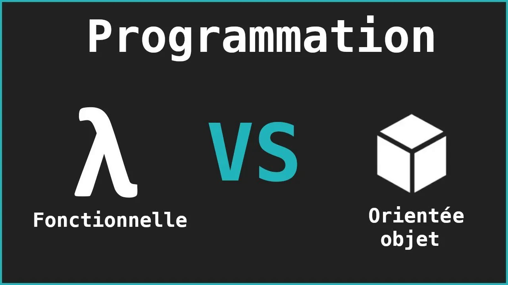

# La programmation orientée objet



Jusqu'ici nous avons principalement utilisé la programmation fonctionnelle (PF).

La programmation fonctionnelle est un type de programmation où l'on vise à créer des programmes en composant des fonctions qui transforment les données.

La programmation orientée objet (POO) est une approche qui met l'accent sur l'utilisation d'objets pour représenter les données et le comportement.

## Quelle différence ?

La PF permet d'écrire des fonctions qui prennent des entrées et renvoient des sorties. Chaque fonction est indépendante et n'est pas reliée à un concept réel.

La POO permet de créer des objets qui représentent des choses du monde réel. Chaque objet possède des attributs (variables) et des comportements (fonctions appelées méthodes). Tout le code de l'objet est regroupé dans une classe. On peut voir la classe comme le plan de construction et l'objet comme une chose réelle faite à partir de ce plan.

### PF

Cette fonction est générique car elle n'est pas liée à un concept particulier comme un chat, un chien ou un humain. On peut la réutiliser facilement partout dans le code.

```python
# declaration d'une fonction
def saluer(name):
    return f"{name} dit waf!"


# utilisation de la fonction
print(saluer("Renaud"))
```

### POO

Ici on crée un concept (classe et objet) chien qui contient ses propres attributs (=variables) et méthodes (fonctions).

```python
# definition de la classe chien
class Chien:
    # constructeur qui s'execute automatiquement a la creation de l'objet chien
    def __init__(self, nom_en_parametre):
        # on prend en parametre un nom
        # self.nom indique que l'objet chien contient un attribut (=variable) nom
        self.nom = nom_en_parametre

    # declaration d'une methode (=fonction) contenue dans l'objet chien
    # quand on est dans une classe, on n'utilise pas le terme fonction mais
    # plutot methode
    def aboyer(self):
        print(f"{self.nom} dit waf!")


# declaration de l'objet chien
mon_chien = Chien("Renaud")

# appel de la methode aboyer de chien
mon_chien.aboyer()

# affichage de l'attribut nom contenue dans chien
print(mon_chien.nom)
```

### Comparaison

|       | Avantages | Inconvénients |
| ----- | --------- | ------------- |
| POO   | Plus facile à modéliser des choses complexes (comme les jeux, les applications) <br> Regroupe les données et le comportement dans des objets séparés <br> Utile pour les grands programmes | Peut être plus difficile à comprendre au début <br> Nécessite plus de code pour des tâches simples           |
| FP    | Code plus simple pour les petites tâches <br> Plus facile pour tester chaque fonction individuellement <br> Souvent plus rapide à écrire | Plus difficile à gérer pour les gros programmes |

Dans des cas d'usages réels, la plupart des programmes python utilisent les deux styles:

- POO pour structurer le programme avec des concepts.
- PF pour écrire de petits outils réutilisables.

Aucune des deux façon de faire est meilleure, mais dans certains cas d'usages on préférera l'une à l'autre. Par exemple, pour faire du calcul scientifique la PF peut être très adaptée avec des fonctions générique (ex: rotate(), image_color_to_grayscale(), ...). Par contre pour faire un jeu il est parfois plus simple de faire de la POO car on a des concepts réels (ex: Player, Board, Bishop, Queen, ...).

## La POO

En POO, on n’a affaire qu’à des classes et des objets (ou instances de classe). Reprenons depuis le début.

### Déclaration de classe et types

Afin de faire de la POO, on doit déclarer une classe.

```python
# declaration
class Animal:
    pass

# creation de l'objet (= instance de classe) animal_1 avec la classe Animal
animal_1 = Animal()

# creation de l'objet (= instance de classe) animal_2 avec la classe Animal
animal_2 = Animal()
```

Ici, nous avons créé deux objets, deux instances de la classe Animal.

Si on affiche le type de ces deux objets grâce à la fonction type, on voit que ces deux objets appartiennent bien à la classe Animal.

```python
# affiche <class '__main__.Animal'>
print(type(animal_1))
```

Donc quand on crée une classe et que l'on instancie un objet le type de l'objet est le nom de la classe ! En fait les types que nous avons vu précédemment comme `int`, `float` ou bien `str` sont aussi des issus de classes.

```python
# class 'int'>
var = 1
print(type(var))

# <class 'float'>
var = 1.5
print(type(var))

# <class 'str'>
var = "Ronald"
print(type(var))

# <class 'list'>
var = [1, 2, 3]
print(type(var))

# <class 'tuple'>
var = (1, 2, 3)
print(type(var))
```

### Les constructeurs

Les constructeurs sont des méthodes (=fonctions) de classe permettant d'initialiser un objet. Lorsque que l'on déclare un objet, cette méthode `__init__` est appelée automatique en première.

```python
class Animal:
    def __init__(self):
        print("Un animal vient est créé.")


# affiche: "Un animal vient est créé."
animal = Animal()
```

### Les attributs

Les attributs sont des variables stockées dans un objet. On accède à l'attribut avec un `.` sur l'objet.

```python
class Animal:
    def __init__(self):
        print("Un animal vient est créé.")
        self.age = 12


# affiche: "Un animal vient est créé."
animal = Animal()

# affiche 12
print(animal.age)
```

Ici, le mot `self` permet de créer une variable dans l'objet. On peut aussi passer une variable dans le constructeur et la stocker dans un attribut. Comme les fonctions, le constructeur peut avoir des valeurs par défaut.

```python
class Animal:
    def __init__(self, parametre_age):
        print("Un animal vient est créé.")
        self.age = parametre_age


# affiche: "Un animal vient est créé."
animal_1 = Animal(12)

# affiche: "Un animal vient est créé."
animal_2 = Animal(parametre_age=16)

# affiche 12
print(animal_1.age)

# affiche 16
print(animal_2.age)

# attribution d'une nouvelle valeur
animal_1.age = 15

# affiche 15
print(animal_1.age)
```

### Les méthodes

Les méthodes sont des fonctions stockées dans un objet. On accède à la méthode avec un `.` sur l'objet.

```python
class Animal:
    def __init__(self, age):
        self.age = age

    def vieillir(self):
        self.age += 1


animal_1 = Animal(age=0)
animal_2 = Animal(age=3)

animal_1.vieillir()
animal_2.vieillir()

# affiche 1
print(animal_1.age)

# affiche 4
print(animal_2.age)
```

Ici, la méthode `vieillir()` a changé la valeur de l'attribut `age`. En POO, une méthode peut accéder à un attribut sans que l'attribut soit dans les paramètres de la méthode (comme dans la fonction `vieillir()`).

Avec une fonction classique, vu que la variable n'est pas stockée dans un objet, on est obligé de la passer en paramètre.

```python
def ma_fonction_1():
    print(var)


def ma_fonction_2(x):
    print(x)


var = 5

# affiche None
print(ma_fonction_1())

# affiche 5
print(ma_fonction_2(var))
```

On peut modifier le code pour aussi avoir des paramètres dans les méthodes.

```python
class Animal:
    def __init__(self):
        self.age = 0
        self.nom = ""

    def vieillir(self):
        self.age = self.age + 1

    def nommer(self, nom):
        self.nom = nom


animal = Animal()

# affiche ""
print(animal.nom)

animal.nommer("Jules")

# affiche "Jules"
print(animal.nom)
```

### L'encapsulation

On a vu précédemment que l'on peut accéder aux attribut de cette manière:

```python
animal.nom = 25
```

Cependant il peut être utile de contrôler quels attributs sont accessibles ou non à l'extérieur de l'objet. Certains attributs peuvent ne pas êtres faits pour être modifiés de l'extérieur car ils sont seulement faits pour le fonctionnement interne de l'objet. Pour cela on crée des méthodes spécifiques.

Les `getter` sont des méthodes qui permettent de retourner la valeur d’un attribut.

Les `setters` permettent de modifier la valeur d’un attribut.

En POO, on distingue différents types d’attributs:

- Les attributs publics: Accessible qu’à l’intérieur de la définition de la classe.
- Les attributs protégés: Accessibles seulement pour la classe et ses classes filles (voir héritage). N'a pas beaucoup de sens en python.
- Les attributs privés: Accessibles partout et toujours.

Dans un langage comme le C++, cette différence public / privé est très stricte: les attributs privés ne sont pas accessibles.

```c++
class MyClass {
    public:
        int x;

    private:
        int y;
};

int main() {
    MyClass myObj;

    // autorise
    myObj.x = 25;

    // le code crash
    myObj.y = 50;

    return 0;
}
```

Avec python on ne rend jamais totalement un attribut privé: tous les attributs sont publics mais on peut faire en sorte de les rendre moins accessibles en nommant les attributs avec 2 underscores avant le nom d'attribut.

```python
class Animal:
    def __init__(self):
        self.__age = 0

    def vieillir(self):
        self.__age = self.__age + 1


animal = Animal()

animal.vieillir()

# AttributeError: 'Animal' object has no attribute '__age'
# l'attribut est prive
print(animal.__age)
```

Mais en réalité il n'est pas vraiment privé mais juste un peu plus caché. On peut y accéder de cette manière.

```python
class Animal:
    def __init__(self):
        self.__age = 0

    def vieillir(self):
        self.__age = self.__age + 1


animal = Animal()

animal.vieillir()

# affiche 1
print(animal._Animal__age)
```

Dans d’autres langages de programmation, c’est ici que les getters et les setters jouent un rôle très important puisque c’est grâce à eux qu’on va pouvoir lire ou modifier ces attributs.

Mais nous pouvons tout de même les définir nous-mêmes:

```python
class Animal:
    def __init__(self):
        self.__age = 0

    def vieillir(self):
        self.__age = self.__age + 1

    def get_age(self):
        print("getter")
        return self.__age

    def set_age(self, valeur):
        print("setter")
        self.__age = valeur


animal = Animal()
animal.vieillir()

# affiche
# getter
# 1
print(animal.get_age())

# affiche
# setter
animal.set_age(1.5)

# affiche
# getter
# 1.5
print(animal.get_age())
```

De la même manière on peut définir des méthodes privées avec 2 underscores avant le nom de la méthode.

Il faut toutefois garder à l’esprit que ce sont des concepts de Programmation Orientée Objet “pure”. Python ne respecte pas vraiment ces principes puisqu’on peut toujours avoir accès à des attributs ou méthodes privés. Dans un langage vraiment orienté objet comme C++ ou Java, on ne peut pas tricher.

### L'héritage

L’héritage en POO permet de créer facilement des classes similaires à partir d’une autre classe. On parle alors de faire hériter une classe fille d’une classe mère. Dans notre exemple de la classe Animal, on va pouvoir faire hériter des classes Reptile, Mammifère ou Oiseau de la class Animal: on continue de construire des classes, et donc des modèles pour des objets, mais ces classes filles vont avoir les attributs et méthodes de la classe mère et des attributs et des méthodes spécifiques à ces classes filles.

```python
class Animal:
    def __init__(self, nom, age):
        self.age = age
        self.nom = nom

    def vieillir(self):
        self.age = self.age + 1

    def renommer(self, nom):
        self.nom = nom


# herite des attributs en méthodes de Animal
class Reptile(Animal):
    pass


reptile = Reptile("Ronald", 0)

# <class '__main__.Reptile'>
print(type(reptile))

# Ronald 0
print(reptile.nom, reptile.age)

reptile.renommer("Harry")

# Harry 0
print(reptile.nom, reptile.age)
```

Dans cet exemple, on voit bien que l’objet reptile est une instance de la classe Reptile mais qu’il a conservé les méthodes et attributs de la classe Animal sans qu’on ait besoin de les redéfinir: c’est toute la force de l’héritage.

On peut toutefois vouloir qu’une méthode d’une classe fille n’ait pas le même comportement que son équivalent dans la classe mère. On redéfinit alors simplement la méthode dans la classe fille. On parle de polymorphisme et cette technique relève de la surcharge de méthode, ou en anglais overriding.

```python
class Animal:
    def __init__(self, nom, age):
        self.age = age
        self.nom = nom

    def vieillir(self):
        self.age = self.age + 1

    def renommer(self, nom):
        self.nom = nom


# herite des attributs en méthodes de Animal
class Reptile(Animal):
    def renommer(self, nom):
        print("surcharge de la méthode")
        self.nom = nom


reptile = Reptile("Ronald", 0)

# affiche "surcharge de la méthode"
reptile.renommer("Harry")
```

De la même manière on peut surcharger le constructeur et/ou une méthode avec le mot clé `super`. Ce mot clé indique d'exécuter la méthode de la classe mère.

```python
class Animal:
    def __init__(self, nom, age):
        self.age = age
        self.nom = nom

    def vieillir(self):
        self.age = self.age + 1

    def renommer(self, nom):
        self.nom = nom


# herite des attributs en méthodes de Animal
class Reptile(Animal):
    def __init__(self, nom, age, longueur):
        # execute le __init__ de animal
        super().__init__(nom, age)
        # ajoute un attribut
        self.longueur = longueur

    def renommer(self, nom, surnom):
        # execute le renommer de animal
        super().renommer(nom)
        # ajoute un attribut
        self.surnom = surnom


reptile = Reptile("Ronald", 0, 14)
reptile.renommer("Harry", "Le H")

# Harry Le H 0 14
print(reptile.nom, reptile.surnom, reptile.age, reptile.longueur)
```

### Les classes abstraites

Les classes abstraites sont un concept fondamental dans la POO qui permet de définir des structures pour d'autres classes sans implémenter toutes leurs méthodes.

Elles sont utilisées pour créer un cadre sur lequel d’autres classes vont s’appuyer.

Elles sont essentielles lorsqu’on souhaite imposer certaines méthodes à toutes les classes dérivées, garantissant ainsi une certaine cohérence et structure dans le code. Les classes abstraites ne peuvent pas être instanciées directement, ce qui signifie qu'on ne peut pas créer d'objets de ces classes.

```python
from abc import ABC, abstractmethod


# Animal herite de ABC
# c'est une classe abstraite
class Animal(ABC):
    # methode abstraite
    @abstractmethod
    def parler(self):
        pass

    # methode non abstraite
    def manger(self):
        print("Miam miam")


class Chien(Animal):
    def parler(self):
        print("Wouf Wouf")


class Chat(Animal):
    def parler(self):
        print("Miaou")


class Oiseau(Animal):
    pass


# crash du code: tentative d'instanciation de la classe abstraite
animal = Animal()

chien = Chien()
chat = Chat()

# crash du code car on a pas redefini parler:
# TypeError: Can't instantiate abstract class Oiseau without
# an implementation for abstract method 'parler'
oiseau = Oiseau()

# "Wouf Wouf"
chien.parler()

# "Miaou"
chat.parler()

# "Miam miam"
chien.manger()
chat.manger()
```
