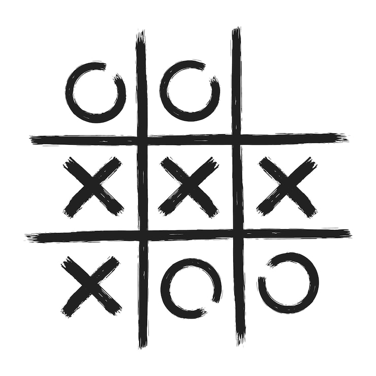
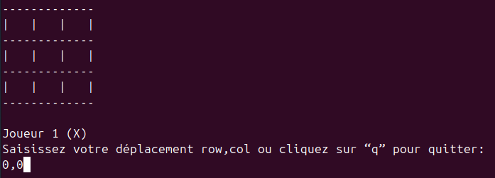
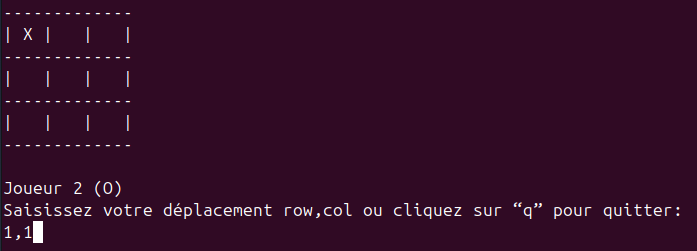
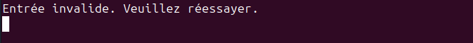
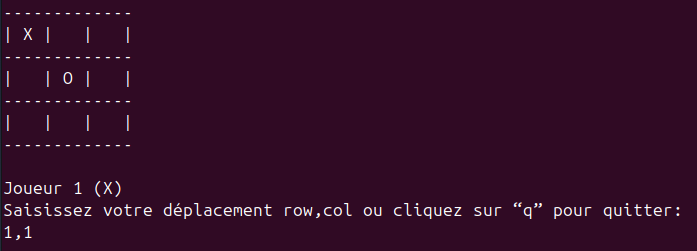
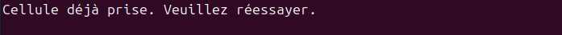
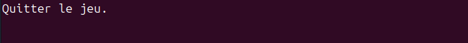
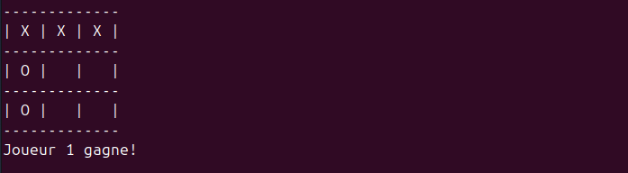
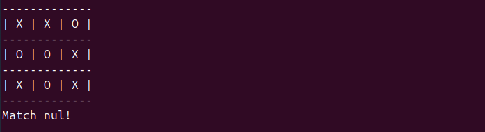

# TP Jeu du tic tac toe

## Exercice

Le tic-tac-toe est un jeu se pratiquant à deux joueurs, tour par tour, dont le but est de créer le premier un alignement.



### Déroulement

Deux joueurs s'affrontent. Ils doivent remplir chacun à leur tour une case de la grille avec le symbole qui leur est attribué : O ou X. Le gagnant est celui qui arrive à aligner trois symboles identiques, horizontalement, verticalement ou en diagonale.

- L'utilisateur saisit des coordonnées au format "0,1".\
  

  

- Une saisie utilisateur invalide.

  

- L'utilisateur doit saisir des coordonnées où la case est vide.\
  

  

- L'utilisateur peut quitter le jeu avec "q".\
  

- L'utilisateur gagne la partie.\
  

- Le match est nul.\
  

Pour réaliser ce TP:

- Ce projet doit être créé dans un projet Git.

- La fonction `main` doit être utilisée.

- Le jeu doit être créé en full POO.

## Exercice 1.1

Créer la classe Board contenant:

- Un attribut `grid` représentant la grille:

  ```bash
  [[" ", " ", " "], [" ", " ", " "], [" ", " ", " "]]
  ```

- Une méthode `show` permettant d'afficher la grille.

  ```python
  def show(self):
    """Show board."""
    print("-" * 13)
    for row in self.grid:
        print("| " + " | ".join(row) + " |")
        print("-" * 13)
  ```

- Une méthode `is_cell_empty` qui à partir d'une ligne et d'une colonne vérifie si la case est vide.

- Une méthode `place_symbol` qui à partir d'une ligne, d'une colonne et d'un symbole met le symbole dans la case.

- Une méthode `is_full` qui vérifie si la grille est complètement remplie.

- Une méthode `check_row` qui vérifie si une ligne a 3 mêmes symboles alignés.

- Une méthode `check_col` qui vérifie si une colonne a 3 mêmes symboles alignés.

- Une méthode `check_diagonals` qui vérifie si une diagonale a 3 mêmes symboles alignés.

- Une méthode `check_win` qui vérifie si un joueur a gagné.

## Exercice 1.2

Créer la classe Player contenant:

- Un attribut `nom` et `symbole`.
- Une méthode `get_move` qui récupère l'entrée utilisateur et vérifie que l'entrée est valide:
  - "q" pour quitter.
  - "x,y" où x et y sont des coordonnées.

La méthode renvoie quelque chose pour chaque cas. On pourra utiliser `re.fullmatch` pour vérifier l'entrée utilisateur.

La bibliothèque re native a python permet d'effectuer des opérations d'expressions régulières. Une expression régulière (RegEx) est une chaîne de caractères qui décrit, selon une syntaxe précise, un ensemble de chaînes de caractères possibles.

```python
import re

chaine = "J'aime coder en Python, 1, 2, 3."

# cherche le motif dans la chaine de caractere
# le motif a ete trouvé aux positions 16 a 22
# <re.Match object; span=(16, 22), match='Python'>
motif = "Python"
print(re.search(motif, chaine))

# cherche le motif dans la chaine de caractere
# le motif n'a pas ete trouve
# None
motif = "ABC"
print(re.search(motif, chaine))

# cherche si l’un des caracteres specifies entre
# les crochets apparait dans une chaine de caracteres
# ['a', 'c']
motif = "[abc]"
print(re.findall(motif, chaine))

# cherche tous les caracteres n’ayant pas ete specifies entre les crochets
# ['J', "'", 'i', 'm', 'e', ' ', 'o', 'd', 'e', 'r', ' ', 'e', 'n', ' ', 'P', 'y', 't', 'h', 'o', 'n', ',', ' ', '1', ',', ' ', '2', ',', ' ', '3', '.']
motif = "[^abc]"
print(re.findall(motif, chaine))

# cherche toutes les lettres minuscules comprises entre a et z
# ['a', 'i', 'm', 'e', 'c', 'o', 'd', 'e', 'r', 'e', 'n', 'y', 't', 'h', 'o', 'n']
motif = "[a-z]"
print(re.findall(motif, chaine))

# cherche toutes les lettres comprises entre a et z, qu’elles soient majuscules ou minuscules
# ['J', 'a', 'i', 'm', 'e', 'c', 'o', 'd', 'e', 'r', 'e', 'n', 'P', 'y', 't', 'h', 'o', 'n']
motif = "[a-zA-Z]"
print(re.findall(motif, chaine))

# cherche tous les chiffres compris entre 0 et 9
# ['1', '2']
motif = "[0-2]"
print(re.findall(motif, chaine))
```

Avec la bibliothèque `re` de nombreuses fonctions permettent d'effectuer des opérations sur des chaînes de caractère avec des expressions régulières. Le but ici n'est pas de montrer tout ce qui est faisable en RegEx mais simplement d'introduire le concept.

## Exercice 1.3

Créer la classe Game qui sera le seul objet dans le main et qui contient:

- Un `board`, deux `players` et un `current_player`.

- Une méthode clear.

  ```python
  def clear(self, sleep=None):
  """Clear the terminal screen by using the command:
  - `cls` if OS is windows.
  - `clear` if not.

  Args:
        sleep (float or None, optional): Number of seconds to wait before
            clearing the screen. Defaults to None.
  """
  # wait for x seconds if sleep is not None value (default value)
  if sleep is not None:
        time.sleep(sleep)

  # use os to execute a terminal command (cls or clear)
  os.system("cls" if os.name == "nt" else "clear")
  ```

  - Une méthode `switch_turn` qui permet de changer le joueur qui joue.

  - Une méthode `play` qui permet de lancer et jouer au jeu.

## Solution

```python
"""Tic Tac Toe game code."""

import os
import re
import time


class Board:
    """Tic Tac Toe Board class."""

    def __init__(self):
        """Initialize Board object."""
        # initialize grid attribut
        self.grid = []

        # add 3 times a nested list to get:
        # [[" ", " ", " "], [" ", " ", " "], [" ", " ", " "]]
        for _ in range(3):
            self.grid.append([" ", " ", " "])

    def show(self):
        """Show board."""
        print("-" * 13)
        for row in self.grid:
            print("| " + " | ".join(row) + " |")
            print("-" * 13)

    def is_cell_empty(self, row, col):
        """Check if a cell is empty or not.

        Args:
            row (int): Row coordinate.
            col (int): Column coordinate.

        Returns:
            bool: Return True if cell is empty, False otherwise.
        """
        # evaluate if cell is empty
        return self.grid[row][col] == " "

    def place_symbol(self, row, col, symbol):
        """Place a symbol in a cell.

        Args:
            row (int): Row coordinate.
            col (int): Column coordinate.
            symbol (str): Player symbol: "X" or "O".
        """
        # put new value in cell
        self.grid[row][col] = symbol

    def is_full(self):
        """Check if the board is full.

        Returns:
            bool: Return True if full, False if at least one cell is empty.
        """
        # iterate on grid
        for row in self.grid:
            for cell in row:
                # cell is empty, terminate function
                if cell == " ":
                    return False
        return True

    def check_row(self, symbol):
        """Check if there are 3 symbols aligned on a row.

        Args:
            symbol (str): Player symbol: "X" or "O".

        Returns:
            bool: True if there are 3 symbols on a row, False otherwise.
        """
        # iterate on rows
        for row in self.grid:
            # 3 symbols are aligned on row
            if row[0] == symbol and row[1] == symbol and row[2] == symbol:
                return True
        return False

    def check_col(self, symbol):
        """Check if there are 3 symbols aligned on a column.

        Args:
            symbol (str): Player symbol: "X" or "O".

        Returns:
            bool: True if there are 3 symbols on a column, False otherwise.
        """
        # iterate on columns
        for col in range(3):
            # 3 symbols are aligned on column
            if self.grid[0][col] == symbol and self.grid[1][col] == symbol and self.grid[2][col] == symbol:
                return True
        return False

    def check_diagonals(self, symbol):
        """Check if there are 3 symbols aligned on the diagonals.

        Args:
            symbol (str): Player symbol: "X" or "O".

        Returns:
            bool: True if there are 3 symbols on a diagonal, False otherwise.
        """
        # 3 symbols are aligned on first diagonal
        if self.grid[0][0] == symbol and self.grid[1][1] == symbol and self.grid[2][2] == symbol:
            return True
        # 3 symbols are aligned on second diagonal
        if self.grid[0][2] == symbol and self.grid[1][1] == symbol and self.grid[2][0] == symbol:
            return True
        return False

    def check_win(self, symbol):
        """Check if a player has won the game.

        Args:
            symbol (str): Player symbol: "X" or "O".

        Returns:
            bool: True if the player has won, False otherwise.
        """
        # return True if at least one of the check function return true
        return self.check_row(symbol) or self.check_col(symbol) or self.check_diagonals(symbol)


class Player:
    """Tic Tac Toe Player class."""

    def __init__(self, name, symbol):
        """Initialize Player object.

        Args:
            name (str): Player name.
            symbol (str): Player symbol: X" or "O".
        """
        # initialize name and symbol attribute
        self.name = name
        self.symbol = symbol

    def get_move(self):
        """Get a move from a player and check its validity.

        Returns:
            tuple or int or None: Return None for quit move, -1 for invalid move
                and tuple for valid move.
        """
        # get user input
        print(f"\n{self.name} ({self.symbol})")
        move = input("Saisissez votre déplacement row,col ou cliquez sur “q” pour quitter:\n")

        # remove extra spaces with strip() and force lowercase with lower()
        move = move.strip().lower()

        # quit game command, return None
        if move == "q":
            return None

        # check input format with re package (regular expressions)
        # input should gull match "[0,1,2],[0,1,2]" format
        # return -1 if input is not valid
        if not re.fullmatch(r"[0-2],[0-2]", move):
            return -1

        # input is valid
        # use split() to split string by a separator ",": "0,2" -> ["0", "2"]
        move = move.split(",")
        # cast coordinates to int
        return int(move[0]), int(move[1])


class Game:
    """Tic Tac Toe Game class."""

    def __init__(self):
        """Initialize Game object."""
        # instantiate board and players objects
        self.board = Board()
        self.player_1 = Player("Joueur 1", "X")
        self.player_2 = Player("Joueur 2", "O")

        # set current player
        self.current_player = self.player_1

    def clear(self, sleep=None):
        """Clear the terminal screen by using the command:
        - `cls` if OS is windows.
        - `clear` if not.

        Args:
            sleep (float or None, optional): Number of seconds to wait before
                clearing the screen. Defaults to None.
        """
        # wait for x seconds if sleep is not None value (default value)
        if sleep is not None:
            time.sleep(sleep)

        # use os to execute a terminal command (cls or clear)
        os.system("cls" if os.name == "nt" else "clear")

    def switch_turn(self):
        """Switch current player when previous player has finished his turn."""
        # swap player 2 to player 1
        if self.current_player == self.player_2:
            self.current_player = self.player_1

        # swap player 1 to player 2
        else:
            self.current_player = self.player_2

    def play(self):
        """Main game function."""
        # clear terminal
        self.clear()

        # playing loop
        while True:
            # show board
            self.board.show()

            # get user move and clear terminal
            move = self.current_player.get_move()
            self.clear()

            # user wants to quit, use break to stop the while loop
            if move is None:
                print("Quitter le jeu.")
                self.clear(sleep=2.0)
                break

            # input is invalid, use continue to skip this loop iteration
            # and go back to loop beginning
            if move == -1:
                print("Entrée invalide. Veuillez réessayer.")
                self.clear(sleep=2.0)
                continue

            # valid move, unpack tuple values
            row, col = move

            # cell already contain a symbol, use continue to skip this loop iteration
            # and go back to loop beginning
            if not self.board.is_cell_empty(row, col):
                print("Cellule déjà prise. Veuillez réessayer.")
                self.clear(sleep=2.0)
                continue

            # move is valid and cell is empty, place a symbol in cell
            self.board.place_symbol(row, col, self.current_player.symbol)

            # check if the player has won, if yes use break to stop the while loop
            if self.board.check_win(self.current_player.symbol):
                self.board.show()
                print(f"{self.current_player.name} gagne!")
                self.clear(sleep=2.0)
                break

            # check if it's a draw, if yes use break to stop the while loop
            if self.board.is_full():
                self.board.show()
                print("Match nul!")
                self.clear(sleep=2.0)
                break

            # swap player turn
            self.switch_turn()


if __name__ == "__main__":
    # instantiate game object
    game = Game()

    # play tic tac toe
    game.play()
```
