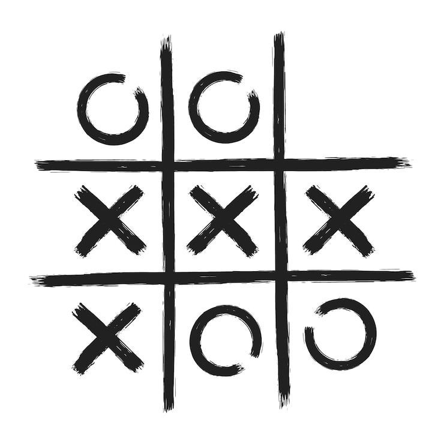
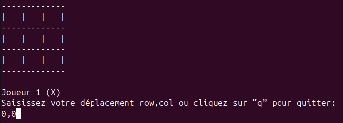
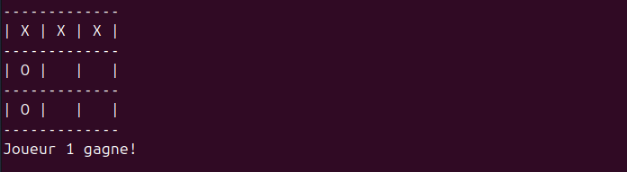
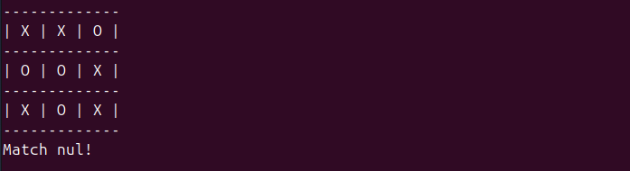

# TP Jeu du tic tac toe

## Exercice

Le tic-tac-toe est un jeu se pratiquant à deux joueurs, tour par tour, dont le but est de créer le premier un alignement.



### Déroulement

Deux joueurs s'affrontent. Ils doivent remplir chacun à leur tour une case de la grille avec le symbole qui leur est attribué : O ou X. Le gagnant est celui qui arrive à aligner trois symboles identiques, horizontalement, verticalement ou en diagonale.

- L'utilisateur saisit des coordonnées au format "0,1".\
  

  

- Une saisie utilisateur invalide.

  

- L'utilisateur doit saisir des coordonnées où la case est vide.\
  

  

- L'utilisateur peut quitter le jeu avec "q".\
  

- L'utilisateur gagne la partie.\
  

- Le match est nul.\
  

Pour réaliser ce TP:

- Ce projet doit être créé dans un projet Git.

- La fonction `main` doit être utilisée.

- Le jeu doit être créé en full POO.

## Exercice 1.1

Créer la classe Board contenant:

- Un attribut `grid` représentant la grille:

  ```bash
  [[" ", " ", " "], [" ", " ", " "], [" ", " ", " "]]
  ```

- Une méthode `show` permettant d'afficher la grille.

  ```python
  def show(self):
    """Show board."""
    print("-" * 13)
    for row in self.grid:
        print("| " + " | ".join(row) + " |")
        print("-" * 13)
  ```

- Une méthode `is_cell_empty` qui à partir d'une ligne et d'une colonne vérifie si la case est vide.

- Une méthode `place_symbol` qui à partir d'une ligne, d'une colonne et d'un symbole met le symbole dans la case.

- Une méthode `is_full` qui vérifie si la grille est complètement remplie.

- Une méthode `check_row` qui vérifie si une ligne a 3 mêmes symboles alignés.

- Une méthode `check_col` qui vérifie si une colonne a 3 mêmes symboles alignés.

- Une méthode `check_diagonals` qui vérifie si une diagonale a 3 mêmes symboles alignés.

- Une méthode `check_win` qui vérifie si un joueur a gagné.

## Exercice 1.2

Créer la classe Player contenant:

- Un attribut `nom` et `symbole`.
- Une méthode `get_move` qui récupère l'entrée utilisateur et vérifie que l'entrée est valide:
  - "q" pour quitter.
  - "x,y" où x et y sont des coordonnées.

La méthode renvoie quelque chose pour chaque cas. On pourra utiliser `re.fullmatch` pour vérifier l'entrée utilisateur.

La bibliothèque re native a python permet d'effectuer des opérations d'expressions régulières. Une expression régulière (RegEx) est une chaîne de caractères qui décrit, selon une syntaxe précise, un ensemble de chaînes de caractères possibles.

```python
import re

chaine = "J'aime coder en Python, 1, 2, 3."

# cherche le motif dans la chaine de caractere
# le motif a ete trouvé aux positions 16 a 22
# <re.Match object; span=(16, 22), match='Python'>
motif = "Python"
print(re.search(motif, chaine))

# cherche le motif dans la chaine de caractere
# le motif n'a pas ete trouve
# None
motif = "ABC"
print(re.search(motif, chaine))

# cherche si l’un des caracteres specifies entre
# les crochets apparait dans une chaine de caracteres
# ['a', 'c']
motif = "[abc]"
print(re.findall(motif, chaine))

# cherche tous les caracteres n’ayant pas ete specifies entre les crochets
# ['J', "'", 'i', 'm', 'e', ' ', 'o', 'd', 'e', 'r', ' ', 'e', 'n', ' ', 'P', 'y', 't', 'h', 'o', 'n', ',', ' ', '1', ',', ' ', '2', ',', ' ', '3', '.']
motif = "[^abc]"
print(re.findall(motif, chaine))

# cherche toutes les lettres minuscules comprises entre a et z
# ['a', 'i', 'm', 'e', 'c', 'o', 'd', 'e', 'r', 'e', 'n', 'y', 't', 'h', 'o', 'n']
motif = "[a-z]"
print(re.findall(motif, chaine))

# cherche toutes les lettres comprises entre a et z, qu’elles soient majuscules ou minuscules
# ['J', 'a', 'i', 'm', 'e', 'c', 'o', 'd', 'e', 'r', 'e', 'n', 'P', 'y', 't', 'h', 'o', 'n']
motif = "[a-zA-Z]"
print(re.findall(motif, chaine))

# cherche tous les chiffres compris entre 0 et 9
# ['1', '2']
motif = "[0-2]"
print(re.findall(motif, chaine))
```

Avec la bibliothèque `re` de nombreuses fonctions permettent d'effectuer des opérations sur des chaînes de caractère avec des expressions régulières. Le but ici n'est pas de montrer tout ce qui est faisable en RegEx mais simplement d'introduire le concept.

## Exercice 1.3

Créer la classe Game qui sera le seul objet dans le main et qui contient:

- Un `board`, deux `players` et un `current_player`.

- Une méthode clear.

  ```python
  def clear(self, sleep=None):
  """Clear the terminal screen by using the command:
  - `cls` if OS is windows.
  - `clear` if not.

  Args:
        sleep (float or None, optional): Number of seconds to wait before
            clearing the screen. Defaults to None.
  """
  # wait for x seconds if sleep is not None value (default value)
  if sleep is not None:
        time.sleep(sleep)

  # use os to execute a terminal command (cls or clear)
  os.system("cls" if os.name == "nt" else "clear")
  ```

  - Une méthode `switch_turn` qui permet de changer le joueur qui joue.

  - Une méthode `play` qui permet de lancer et jouer au jeu.
