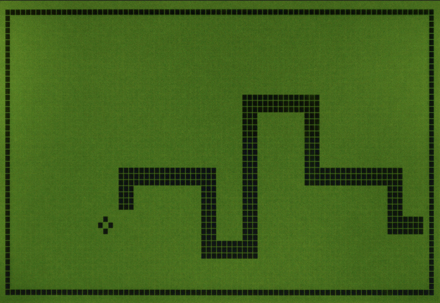
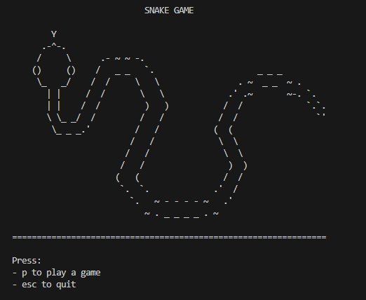
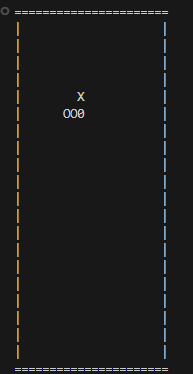
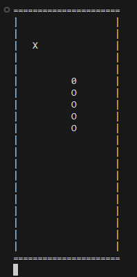
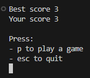
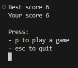

# Projet Snake

## Exercice

Le snake est un jeu vidéo dans lequel le joueur dirige un serpent qui grandit en mangeant et constitue ainsi lui-même un obstacle en plus des murs du terrain. La longueur du serpent constitue le score du joueur.



### Déroulement

Le joueur contrôle un serpent, qui doit éviter de toucher les murs du terrain ainsi que son propre corps. Pour gagner des points, le joueur doit faire manger à son serpent un certain nombre de pastilles similaire à de la nourriture, allongeant à chaque fois la taille du serpent. Alors que le serpent avance inexorablement, le joueur ne peut que lui indiquer une direction à suivre (en haut, en bas, à gauche, à droite) afin d'éviter que la tête du serpent ne touche les murs ou son propre corps, auquel cas il risque de mourir.

- Menu du jeu. L'utilisateur peut quitter avec la touche escape ou jouer avec la touche p.\
  

- Lancement du jeu. Le serpent comment avec un taille et une direction. L'utilisateur peut changer la direction avec les touches &uarr; &darr; &larr; &rarr;. Un marqueur de nourriture est placé aléatoirement sur le terrain a une position ou le serpent n'y est pas. Si la tête du serpent touche la nourriture il grandit et une nouvelle nourriture est générée. Si la tête du serpent touche un mur ou son propre corps, l'utilisateur a perdu.\
  

- Le serpent peut grandir de cette manière.\
  

- Lorsque l'utilisateur perd, on affiche son score ainsi que le meilleur score des anciennes parties.\
  

  

Pour réaliser ce TP:

- On va créer un environnement conda appelé `snake`. On y installera python, pip et keyboard en deux commandes. Puis on utilisera cet environnement dans VSCode.

  ```bash
  conda install python pip
  pip install keyboard
  ```

- Ce projet doit être créé dans un projet Git.

- La fonction `main` doit être utilisée.

- Le jeu doit être créé en full PF.

On utilisera `keyboard.is_pressed` pour détecter qu'une touche est pressée. Contrairement a `input`, cette fonction n'attend pas que l'utilisateur ait validé avec entré, donc le code peut continuer de tourner.

Quelques fonctions utiles.

```python
import os


def clear():
    """Clear the terminal screen by using the command:

    - `cls` if OS is windows.
    - `clear` if not.
    """
    os.system("cls" if os.name == "nt" else "clear")


def welcome():
    """Display game logo and welcome message"""

    clear()

    ascii_snake = r"""
        Y
      .-^-.
     /     \      .- ~ ~ -.
    ()     ()    /   _ _   `.                     _ _ _
     \_   _/    /  /     \   \                . ~  _ _  ~ .
       | |     /  /       \   \             .' .~       ~-. `.
       | |    /  /         )   )           /  /             `.`.
       \ \_ _/  /         /   /           /  /                `'
        \_ _ _.'         /   /           (  (
                        /   /             \  \
                       /   /               \  \
                      /   /                 )  )
                     (   (                 /  /
                      `.  `.             .'  /
                        `.   ~ - - - - ~   .'
                           ~ . _ _ _ _ . ~
    """
    # compute longest ascii snake line
    longest_line = max(len(line) for line in ascii_snake.splitlines())

    # display logo and welcome text
    print("=" * longest_line)
    print("SNAKE GAME".center(longest_line))
    print(ascii_snake)
    print("=" * longest_line + "\n")


def draw(width, height, snake_coords, food_coords):
    """Draw snake, food and map.

    Args:
        width (int): Map width.
        height (int): Map height.
        snake_coords (list): Snake coordinates of shape [(x1, y1), (x2, y2), ...] where first
                             coordinate is snake head.
        food_coords (tuple): Food coordinate of shape (x, y).
    """
    clear()
    print("=" * (width + 2))
    for y in range(height):
        line = ""
        for x in range(width):
            if (x, y) == snake_coords[0]:
                line += "0"
            elif (x, y) in snake_coords:
                line += "O"
            elif (x, y) == food_coords:
                line += "X"
            else:
                line += " "
        print("|" + line + "|")
    print("=" * (width + 2))
```

## Solution

Afin de voir un projet avec plusieurs fichiers, la solution est visible [ici](../project/).
